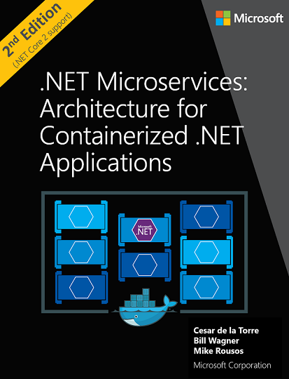

Suppose you now want to read text from the stock images that your frontline distributors post to your server. In particular, you want to scan product looking for promotional stickers that containing sale prices. It's time to try the optical character recognition (OCR) feature of the Computer Vision API. 

## Calling the Computer Vision API to extract printed text

The `ocr` operation detects text in an image and extracts the recognized characters into a machine-usable character stream. The request URL has the following format:

`https://<region>.api.cognitive.microsoft.com/vision/v2.0/ocr?language=<...>&detectOrientation=<...>`

As usual, all calls must be made to the region where the account was created. The call accepts two optional parameters:

- **language**: The language code of the text to be detected in the image. The default value is `unk`,or unknown. This let's the service auto detect the language of the text in the image.
- **detectOrientation**: When true, the service  tries to detect the image orientation and correct it before further processing, for example, whether the image is upside-down. 

[!INCLUDE [get-key-note](./get-key.md)]

## Extract printed text from an image using OCR

The image we're going to be using for Optical Character Recognition (OCR) is the cover from the book *.NET Microservices: Architecture for Containerized .NET Applications*.



1. Execute the following command in Cloud Shell. Replace `<region>` in the command with the region of your cognitive services account.

```azurecli
curl "https://<region>.api.cognitive.microsoft.com/vision/v2.0/ocr" \
-H "Ocp-Apim-Subscription-Key: $key" \
-H "Content-Type: application/json"  \
-d "{'url' : 'https://raw.githubusercontent.com/MicrosoftDocs/mslearn-process-images-with-the-computer-vision-service/master/images/ebook.png'}" \
 | jq '.'
```

The following JSON is an example of the response we get from this call. Some lines of JSON have been removed to make the snippet fit better on the page.

```json
{
  "language": "en",
  "orientation": "Up",
  "textAngle": 0,
  "regions" : [
        /*... snipped*/
        {
          "boundingBox": "766,1419,302,33",
          "words": [
            {
              "boundingBox": "766,1419,126,25",
              "text": "Microsoft"
            },
            {
              "boundingBox": "903,1420,165,32",
              "text": "Corporation"
            }
          ]
        }]
}
```

Let's examine this response in more detail. 

- The service identified the text as being English. The value of the `language` field contains the BCP-47 language code of the text detected in the image. In this example it is **en**, or English. 
- The `orientation` was detected as **up**. This property is the direction that the top of the recognized text is facing, after the image has been rotated around its center according to the detected text angle. 
- The `textAngle` is the angle by which the text must be rotated to become horizontal or vertical. In this example, the text was perfectly horizontal, so the value returned is **0**.  
- The `regions` property contains a list of values used to show where the text is, its position in the picture, and the word found in that part of the image. 
- The four integers of the `boundingBox` value are: 
    - the x-coordinate of the left edge 
    - the y-coordinate of the top edge
    - the width of the bounding box
    - the height of the bounding box, 
   
    You can use these values to draw boxes around every piece of text found in the image.

As you can see in this exercise, the `ocr` service gives detailed information about the printed text in an image. 

For more information about the `ocr` operation, see the [OCR](https://westus.dev.cognitive.microsoft.com/docs/services/5adf991815e1060e6355ad44/operations/56f91f2e778daf14a499e1fc) reference documentation.