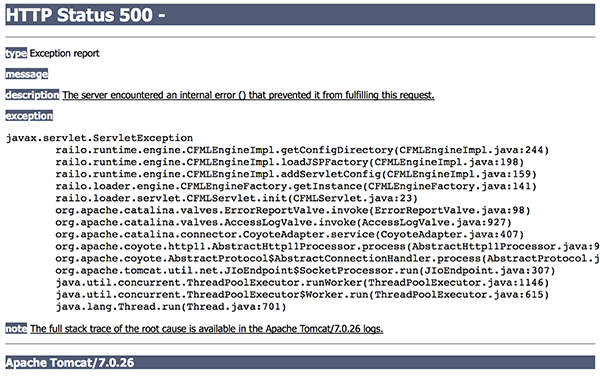

The best place to start is often the beginning. Let’s start by just asking the basic question “What is Site Reliability Engineering?”
There are a number of answers to this question floating around, including [the one often quoted](https://landing.google.com/sre/book/chapters/introduction.html) by the person who coined the term (Ben Treynor Sloss at Google), but this is the most practical answer we can offer:

> Site Reliability Engineering is an engineering discipline devoted to helping an organization achieve the appropriate level of reliability in their systems, services, and products.

Later on we may bring some other definitions into the picture, but lets start from here. There are two crucial parts to this definition we need to unpack that will leads us right to the “Why does it matter?” question.

## Reliability

At the very heart of (and smack in the middle of the name "SRE") is that word Reliability. The definition doesn’t say “appropriate level of performance” or “appropriate level of efficiency” or “appropriate level of stability” or even “achieve the appropriate level of income”. It says “appropriate level of reliability”. Why?

Let’s look at a quick demonstration. Here’s a screenshot. What do you think it is showing? Try not to move on until you have an idea or you give up. Note: if it is hard to detect very much detail in the picture below that’s fine, it is rendering perfectly in your browser.

   

This picture is a screenshot of what a PHP app (without other debugging support added) looks like when it fails. You might see something like this for a Java app:

   

Why are we looking at these examples? Each of them represents an application that potentially took a business huge amounts of time, energy, and resources to create. But if the application isn’t up--if it isn’t operational when a customer needed to access it--if it isn’t reliable—-it does no one, especially the business any good. In fact, a lack of reliability can do actual harm (reputational, economic, contractual, morale, and so on) to a business.

This is why reliability is so important and why SRE chooses to focus on it as a fundamental property, perhaps the fundamental property of the service, system, or product. Reliability can encompass a number of things (we’ll talk about this some more later), but lets move on to the second crucial part of the definition.

## Appropriate levels of reliability

You may not have caught it the first time you read the definition, but lets emphasize another important word:

> Site Reliability Engineering is an engineering discipline devoted to helping an organization achieve the *appropriate* level of reliability in their systems, services, and products.

Why does that word matter so much?

An important observation made by the SRE world is there are very few systems and services that have to be 100% reliable. Life and death situations like aviation, medical devices, etc. are a notable exception.

In fact, there are very few situations where it is even desirable. The effort and resources (and hence the cost) needed to achieve greater reliability rises at a steep rate as greater reliability is sought. To say it another way, chasing after reliability you don’t need is a waste of time and money. _You want to achieve the appropriate level of reliability in your system, services, and products._ 

The level needs to match the business needs and be pragmatic. For example, if your customers connect to you over a network that isn’t 100% reliable (let’s say it is up 90% of the time), spending the effort and money to make sure your service is 95% reliable is by definition a waste of time and money. _You want to achieve the appropriate level of reliability in your system, services, and products._

SRE takes this pragmatism one more step. If we can now think about there being a desirable level of reliability, is there something we should do if we are successful at meeting or surpassing that level? Similarly, what if we don’t achieve it? We'll answer these questions later in the module.

