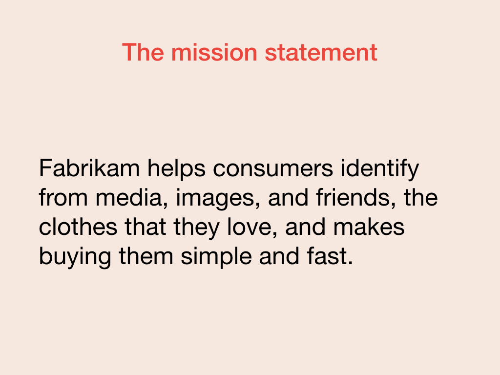
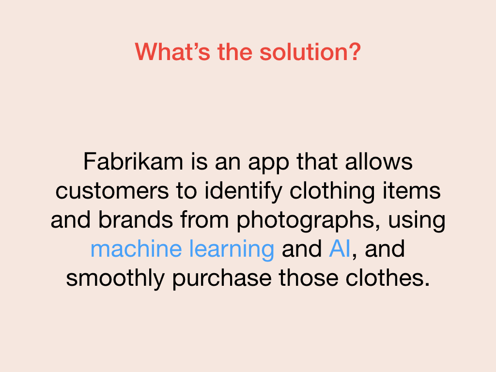
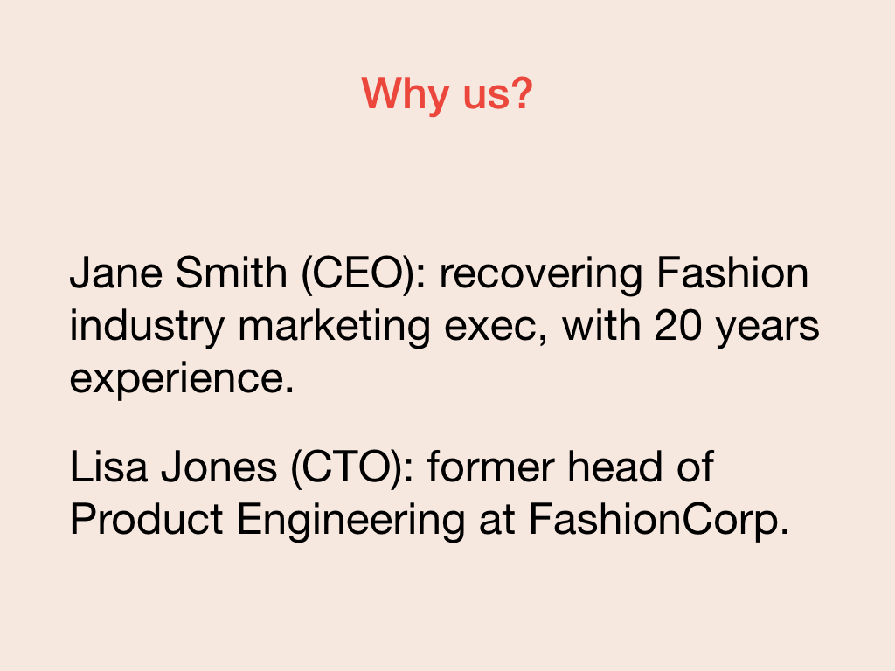

A pitch deck is the medium through which you share your prototype with investors, customers, or future employees. At the core of your pitch deck is the mission: the problem you're solving and your solution. You need to be able to articulate that mission quickly and concisely and leave a hook to engage whomever you are pitching. This articulation is often described as your "elevator pitch": a pitch given in the time it takes you to ride an elevator.

One of the best ways to open your pitch is to use storytelling. Create a story that wraps your mission and captures why your product is worth investing in:

> Hi, I'm Jane Smith, the CEO of Fabrikam. Last year, I went to a friend's wedding, and I was really taken with one of my fellow guest's outfit. I forgot to ask her where she got the outfit at the wedding, but when I got home, I realized I had a photo of the outfit. I tried to use the picture to find the outfit but found the experience frustrating and ultimately unsuccessful. That inspired me to build Fabrikam, an app which uses machine learning and AI to identify fashion brands from photographs and makes it easier for you to find and buy the clothes you love. Our users convert 16x times more often than traditional sales techniques. We're seeking investment, and I'd love to demo our product for you.

A prototype pitch is an extension of your elevator pitch, with the bonus of having something to show your audience beyond the story in your elevator pitch. You can turn your mission into some key opening slides for your pitch deck.

Since you hopefully have slightly longer than an elevator ride to explain your product, your story is just the start. The initial hook for your audience. 

A good pitch is composed of four major parts:

* The story
* The problem
* The solution
* Why we are the right people.

Try to get at least 30 minutes in front of an audience. That gives you lots of time to talk through your whole pitch and answer any questions.

Let's look at these other parts.

## What's the problem

State the problem you're trying to solve. Addressing this problem should be at the heart of your prototype. In our example, identifying a clothing item and its brand from an image is hard and time-consuming. Even if you can, it's often difficult to track the item down to a store to buy it.

## Here's the solution

Once you've articulated the problem, you need to share the solution you've built to solve the problem. You should include any unique properties or competitive advantages your product brings to the problem. In our case, our Fabrikam app makes it easier to identify who makes the clothes you want using machine learning and AI. Then allows you to buy those clothes without leaving the app.

## Why are we the right people

Lastly, we need to tell the audience why you and your team are the right people to solve this problem. The reasons could be based on experience, specialized knowledge, or empathy for the customer. If you don't have relevant experience, then articulating prior success is a good substitute.

Lastly, here are some important tips to make sure you deliver the best possible pitch.

## Practice does make perfect

Have your pitch down cold. Repetition will make you comfortable and appear confident. Pitching is a stressful process, knowing your material inside and out, is one way to reduce the overall stress of the situation.

## Be authentic and honest

If, you don't know the answer to a question or you get asked something you haven't prepared for, don't wing it. Instead, explain that you don't have the answer right now and that you'll get back to them. This approach is better than answering a question unprepared or disingenuously.

## Be passionate

Remember! Be passionate in your pitch. A sense of genuine enthusiasm and passion for your mission and your product will be apparent to your audience and sends the message that you're committed.