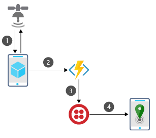

When you book cab using your mobile app, have you ever wondered how your exact location gets shared with the cab driver via SMS. Just Imagine if you could have access to similar aap of your own that could share your exact geographical location through an SMS with a bunch of your friends at the same time, all in a single click. You can easliy do this by creating a mobile app using Azure Functions and Twilio. 

Twilio is a communications platform that is supported by Azure Functions using Twilio SMS output bindings. In this module, you'll create a cross-platform Xamarin.Forms app with a serverless back end. This app will get the user's location from their device and send it with a list of phone numbers to Azure Functions. The function will then use a binding to a third-party service (Twilio) to send your location as an SMS message to all the phone numbers provided.

This process involves the following steps:

1. The app captures your location using Xamarin.Essentials as an abstraction over device-specific location APIs.

1. The location and phone numbers are packaged up into a JSON payload and sent to Azure Functions.

1. The Azure Functions decodes the JSON payload and creates SMS messages.

1. The SMS messages are sent via [Twilio](https://www.twilio.com/?azure-portal=true).

The following illustration shows an overview of this process.

