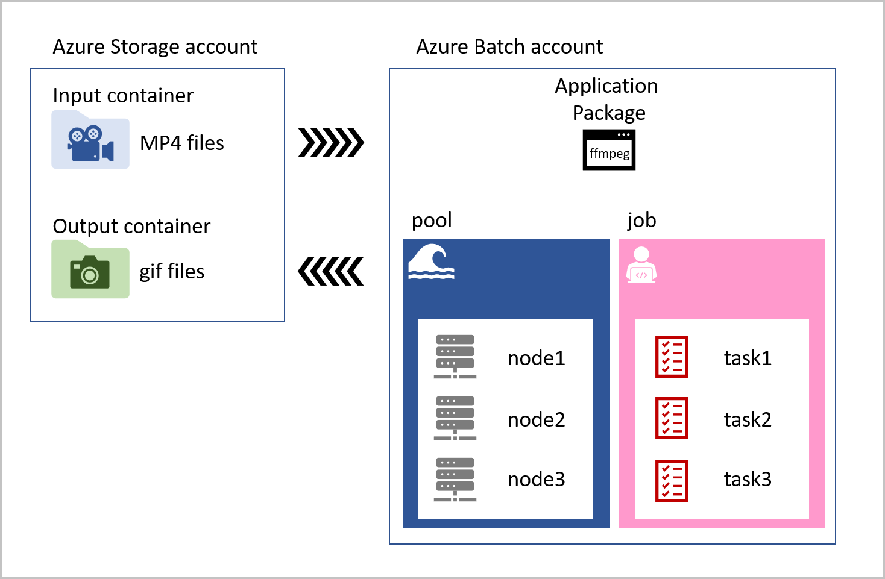

Azure Batch is a collection of resources you combine together to produce a large-scale parallel, highly performant solution.

You decide to write the app that manages the entire Azure Batch process as a .NET Core console application for now. First, the app uploads the pet videos to the cloud. It then creates an Azure Batch pool with compute nodes (Virtual Machines). The app then creates a job to run on those nodes. 

The job that runs on each compute node contains tasks for every video that has been uploaded to the input storage container. The task loads the MP4 pet videos, convert them to animated GIFs, and saves the files to an output container. The task reference the ffmpeg library that is stored as an application package in the Azure Batch account. Our solution is visualized in the following diagram.

Azure Batch is used in combination with Azure Storage. Azure Storage provides the location for any input data, a place for logging and monitoring information, and storage for the final output. The applications that an Azure Batch runs can also be stored there, or a more flexible option is to use the application package feature of Azure Batch.

The components of Azure Batch are:

**Azure Batch account**: A container that holds the following resources needed for our Azure Batch solution:
- **Application Package**: Used to add applications that can be used by tasks in a Batch. An Azure Batch account can contain up to 20 application packages. A request can be made to increase this limit if your company requires more.
- **Pool**: Contains compute nodes, which are the engines that run your Batch job. You specify the number, size, and operating system of nodes at creation time. An Azure Batch account can contain many pools.
- **Node**: Each node can be assigned a number of tasks to run, the tasks are allocated and managed by Azure Batch. Nodes are associated with a specific pool.
- **Job**: Jobs manage collections of tasks. A job is associated with a specific pool. An Azure Batch account can have many jobs.
- **Task**: Tasks run applications. These can be contained in an application package, or in an Azure Storage container. Tasks process input files, and on completion can write to output containers.

Before you can start to manage the Azure Batch components from within a .NET application, you have to create the Azure Batch account and Azure Storage account. You can use Azure portal, Powershell, or Azure CLI to create these accounts.

## Why use an app to manage Batch workloads

Using an app to control Azure Batch processing enables you to automate the running and monitoring of the tasks in your Azure Batch. The rich set of client APIs that are available allow you to control the entire Batch workflow from your code. Once the batch processing has completed, the app can then delete the created resources automatically, keeping the Azure costs low.

Batch workloads make it possible to scale to thousands of nodes, making solutions that need processor intensive compute resources, like video transcoding, weather forecasting, and image analysis more feasible. All these use cases become more efficient when they're managed programmatically.

### Batch client service APIs

Microsoft has released Batch APIs for a range of languages. Using these client libraries, you can programmatically control all the components of the Batch process. From the authentication, processing files, creating pools of nodes, creating jobs with tasks, and then monitoring the state of those running tasks.

In .NET, these Batch APIs are loaded as NuGet packages into your apps. We'll also use the Azure Storage client library to manage files and assets in our solution. 

### How to use a .NET app to control Azure Batch

The steps you'll be following in the rest of the module create Azure Batch and Azure Storage accounts using the Azure portal. Then you'll upload the ffmpeg application as an application package to make it available to use in tasks. Your app will be using tasks that run ffmepg to convert the videos.

With the Batch and Storage accounts created in the Azure portal, you'll then need to create a .NET Core console app in the Cloud Shell that uses the Azure Batch and Azure Storage client libraries.

Your app will use the Azure Storage client library to upload the MP4 videos into blob storage. The app will then use the Batch client library to create a pool with three nodes (Windows Server VMs), create a job, and then add video conversion tasks to the job to run on those nodes. With the tasks running, the app needs to monitor their status, check they complete successfully, and clear down unwanted resources.