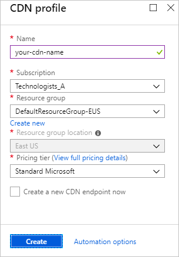
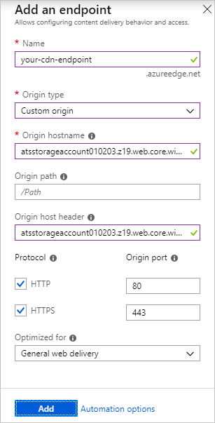

Serving video files to global users will likely benefit from a Content Delivery Networks (CDN). Here you'll learn how to create a CDN endpoint and profile. Then you'll see how to configure the endpoint to cache content from a static website.

[!include]

## Create a Content Delivery Network

Now, you'll create a CDN and connect that CDN to the website that you've created from your storage account.

[!include]

1. Sign into the [Azure portal](https://portal.azure.com/learn.docs.microsoft.com?azure-portal=true) using the same account you used to activate the sandbox.

1. In the Azure portal, click **Create a resource**.

1. In the **New** pane, click **Web**.

1. Under **Featured**, click **CDN** (or search for **CDN**).

1. Give your CDN a name, such as **yourinitials-cdn**.

1. Under **Resource Group**, select the existing Resource Group ("**<rgn>[sandbox resource group name]</rgn>**") from the drop-down list.

1. Under **Pricing tier**, select **Standard Microsoft**.

1. Ensure that **Create a new CDN endpoint now** isn't selected, then click **Create**.

When you've created the profile, click the Notifications (bell) icon, then click **Successfully created a CDN profile** to display the CDN profile pane.

## Create a CDN Endpoint

You now need to create a CDN profile that connects to the source web server in the storage account. Take the following steps:

1. In the CDN Profile blade, click **+ Endpoint**.

1. In the **Add an endpoint** blade, enter a name for the endpoint.

1. In the **Origin type** list, select **Custom origin**. 

> [!NOTE]
> **Origin type** specifies what type of hosting service is used. **Custom origin** is used for any other type of publicly accessible origin webserver. This can be a webserver hosted on Azure or elsewhere.

1. In the **Origin hostname** field, enter the URL from when you created the web site. Remove the **https://** and the final trailing slash character.

1. Click **Add** to create the endpoint. Note the message that it can take up to 10 minutes for the settings to reach every CDN POP.

1. After 10 minutes has elapsed, click the **Endpoint hostname** link. The web site should display.

