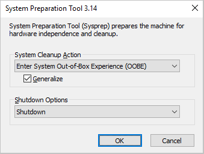
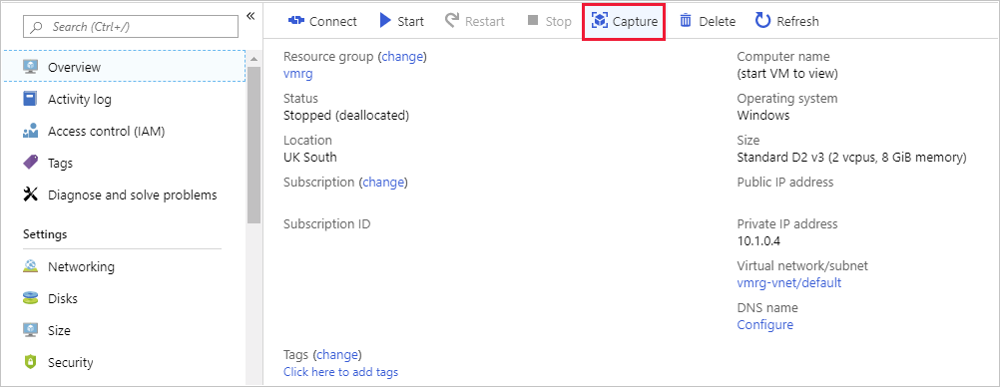
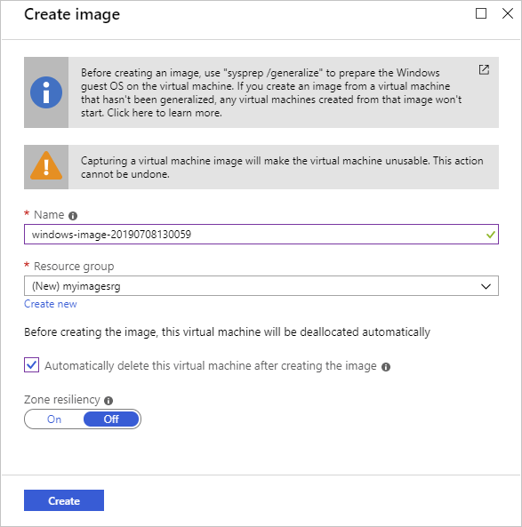
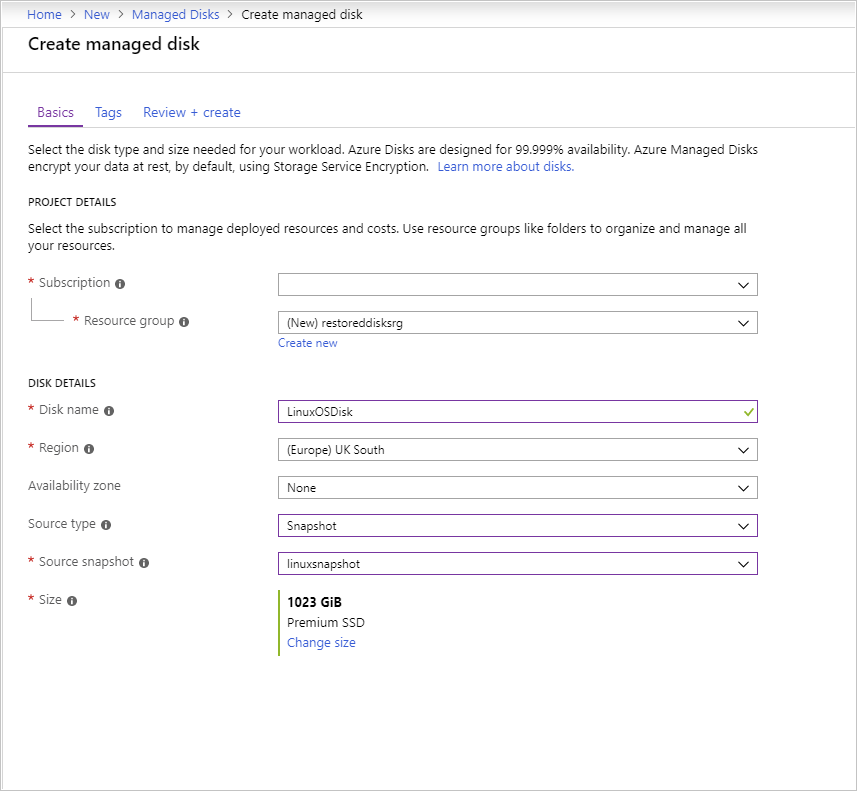

You've learned about Azure images, how you can use a generalized image to build pre-configured virtual machines, and how you can use a specialized image as a snapshot of a virtual machine at a particular point in time.

In the sample scenario, you need to create generalized images for a variety of virtual machines. Some of these virtual machines will run Windows, while others require Linux.

In this unit, you'll learn how to customize an image, and then generalize this image so you can use it to deploy virtual machines. You can create virtual machines running Windows and Linux, but the tools and techniques to use to build a generalized image vary according to the operating system.

## Generalize a Windows virtual machine

If you're building a Windows image, you use the **sysprep** utility to prepare a virtual machine for generalization. Sysprep removes server-specific information from the image, such as the hostname, user sign-in information, and logs. Sysprep also removes any machine-specific identifiers used internally by Windows.

> [!IMPORTANT]
> Running **sysprep** is a destructive process, and you cannot easily reverse its effects. Back up your virtual machine first.

To generalize a Windows VM, follow these steps:

- Sign in into the Windows virtual machine.
- Open a command prompt as an administrator.
- Browse to the directory *\windows\system32\sysprep*.
- Run **sysprep.exe**.
- In the System Preparation Tool dialog box, select the following settings, and then click **OK**.

    | Property  | Value  |
    |---|---|
    | System Cleanup Action | Enter System Out-of-Box Experience (OOBE) |
    | Generalize | Check  |
    | Shutdown Options | Shutdown |

    

After the virtual machine has been shut down, you must deallocate it while it's in this clean state. If you're using PowerShell, run the following command:

```powershell
Stop-AzVM -ResourceGroupName <resource group> `
    -Name <virtual machine name> `
    -Force
```

If you're running the Azure CLI, use the following command instead:

```azurecli
az vm deallocate \
    --resource-group <resource group> \
    --name <virtual machine name>
```

## Generalize a Linux virtual machine

If you're building a Linux image, you use the **waagent** tool to prepare a virtual machine for generalization. The **waagent** tool performs a number of tasks, including deleting the most recently created user account, removing public SSH keys, resetting the host name and other machine-specific details, and cleaning log files.

To generalize a Linux virtual machine, sign into the machine, and run the following command:

```bash
waagent -deprovision+user
```

You'll receive a series of warning messages similar to the following. In this example, *azureuser* is the name of the user account created when the virtual machine was built.

```text
WARNING! The waagent service will be stopped.
WARNING! Cached DHCP leases will be deleted.
WARNING! root password will be disabled. You will not be able to login as root.
WARNING! /etc/resolv.conf will be deleted.
WARNING! azureuser account and entire home directory will be deleted.
```

You should then disconnect from the virtual machine.

Finally, you must deallocate and generalize the virtual machine while it's in this clean state. If you're using PowerShell, run the following series of commands:

```powershell
Stop-AzVM -ResourceGroupName <resource group> `
    -Name <virtual machine name> `
    -Force

Set-AzVM -ResourceGroupName <resource group> `
    -Name <virtual machine name> `
    -Generalize
```

If you're using the Azure CLI, use the following commands to deallocate and generalize a virtual machine:

```azurecli
az vm deallocate \
    --resource-group <resource group> \
    --name <virtual machine name>

az vm generalize \
    --resource-group <resource group> \
    --name <virtual machine name>
```

## Create an image from a generalized virtual machine

Once you have generalized the virtual machine, you can create an image. The image will include all of the disks associated with the virtual machine. You can create an image from the generalized virtual machine using the Azure portal, the Azure CLI, or PowerShell.

To create an image in the Azure portal, go to the page for the virtual machine, and select **Capture**:



On the **Create image** page that follows, give your image a name and specify a resource group in which to store the image. You can optionally remove the virtual machine once the image has been created. Additionally, you can create resilient images that are backed by zone-redundant storage. This feature provides increased availability for your images. Select **On** for **Zone resiliency** to enable this feature.



> [!IMPORTANT]
> When you create a virtual machine image in this way, the original virtual machine becomes unusable. You cannot restart it. Instead, you must create a new virtual machine from the image, as described later in this unit.

If you're using PowerShell or the Azure CLI, you can create a virtual machine image from a generalized and deallocated virtual machine using the following commands. In both examples, the image will be created in the same resource group as the original virtual machine:

```powershell
$vm = Get-AzVM -ResourceGroupName <resource group> `
    -Name <generalized virtual machine>

$image = New-AzImageConfig -SourceVirtualMachineId `
    $vm.ID -Location<virtual machine location>

New-AzImage -Image $image `
    -ImageName <image name> `
    -ResourceGroupName <resource group>
```

```azurecli
az image create \
    --name <image name> \
    --resource-group <resource group> \
    --source <generalized virtual machine>
```

## Create a new virtual machine from a generalized image

You can build a new virtual machine using your generalized image. The simplest way to do this is to use the Azure portal. Go to the page for your image, and select **+ Create VM**. You'll be prompted for the machine-specific details, such as the virtual machine name, user account, virtual machine size, network ports to open, and so on.

Alternatively, you can use the PowerShell `New-AzVm` command, or the Azure CLI `az vm create` command. The examples below illustrate the syntax:

```powershell
New-AzVm `
    -ResourceGroupName <resource group> `
    -Name <new virtual machine name> `
    -ImageName <image name> `
    -Location <location of image> `
```

```azurecli
az vm create \
    --resource-group <resource group> \
    --name <new virtual machine name> \
    --image <image name> \
    --location <location of image>
```

## Create a snapshot of a VHD

A virtual machine image contains an image of every VHD in the virtual machine. You can also create separate snapshot images of a VHD at any time. A snapshot is a read-only copy of a VHD. You can use a snapshot to restore a VHD to the state it was in when the snapshot was taken.

If you're taking an image of a virtual machine that spans several VHDs, you must ensure that all disk activity has stopped, and that you take a snapshot of every VHD. Failure to do this can result in inconsistencies if you need to restore the virtual machine from these snapshots. By stopping the virtual machine, you can ensure that there is no disk activity and that a successful snapshot is taken.

Unlike creating an image of a virtual machine, capturing a snapshot of a VHD is a non-destructive process, and you can continue running virtual machines using the VHD afterwards.

## Create a virtual machine from VHD snapshots

Rebuilding a virtual machine from a set of VHD snapshots is a two-step process:

- For each snapshot, create a new managed disk. Specify the snapshot as the source of the managed disk. The simplest way to do this is to use in the Azure portal, as shown in the following image:

  

- Create the new virtual machine using these managed disks. This can be done through PowerShell, the Azure CLI, or through the portal.
