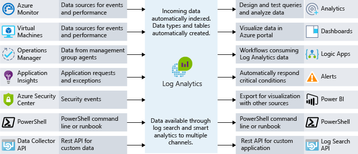
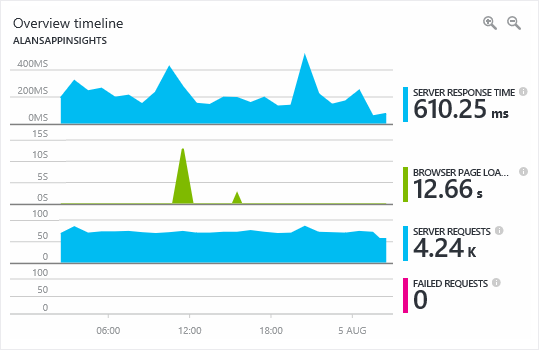

Monitoring is the act of collecting and analyzing data to determine the performance, health, and availability of your business application and the resources that it depends on. What if you ran an operations team responsible for resources running on Azure? What would you do to ensure you had visibility into the health of your systems? If something happens, who finds out first, your team or your end users? An effective monitoring strategy helps you focus on the health of your application. It also helps you increase your uptime by proactively notifying you of critical issues, so that you can resolve them before they become problems. 

When it comes to monitoring and analytics on Azure, we can bundle services into three specific areas of focus: deep application monitoring, deep infrastructure monitoring, and core monitoring. In this unit, we'll take a look through each of these bundles and how Azure services enable these capabilities for your architecture. Even though we've grouped these services together, there are several integration points between them, allowing for sharing of important monitoring data points between them. The following illustration shows the available monitoring services assembled into logical groups.

## Core monitoring

Core monitoring provides fundamental, required monitoring across Azure resources. When we talk about fundamental monitoring, you can think of this as monitoring what is happening with your resources at the Azure platform level. This area of focus gives you insight into things like the health of the Azure platform, insight into changes being made to your resources, and performance metrics. Using services from this area gives you the ability to monitor the basic pieces you need to keep your application running.

Azure provides services to give you visibility into four key core monitoring areas: activity logging, the health of services, metrics and diagnostics, and recommendations on best practices. These services are built in to Azure and take little to no configuration to enable and set up. Let's take a closer look.

### Activity logging

Activity logging is incredibly important to get information on what is happening with your resources at the Azure platform level. Every change submitted to the Azure platform is logged to the Azure Activity Log, giving you the ability to trace any action taken on your resources. Activity Log will contain detailed information on activities to help you answer questions like:

- Who has attached a disk to this virtual machine?
- When was this machine shut down?
- Who changed the load balancer configuration?
- Why did the autoscale operation on my virtual machine scale set fail?

Using Activity Log to answer these types of questions will help you troubleshoot issues, track changes, and provide auditing of what's happening in your Azure environment. Activity Log data is only retained for 90 days and can be archived to a storage account or sent to Azure Log Analytics for longer retention and further analysis.

### Health of cloud services

At some point, any system can have issues, and that's true for Azure services as well. Staying informed of the health of Azure services will help you understand if and when an issue impacting an Azure service is impacting your environment. What may seem like a localized issue could be the result of a more widespread issue, and Azure Service Health provides this insight. Azure Service Health identifies any issues with Azure services that might affect your application. Service Health also helps you plan for scheduled maintenance.

### Metrics and diagnostics

For issues that are more localized in nature, it's important to have visibility into what is happening on your system or service instance. The ability to view metrics and diagnostic information is critical to troubleshoot performance issues and stay notified when something goes wrong. To provide this visibility, Azure services have a common way of showing health, metric, or diagnostic information. Azure Monitor enables core monitoring for Azure services by allowing the collection, aggregation, and visualization of metrics, activity logs, and diagnostic logs.

Metrics are available that provide performance statistics for different resources and even the operating system inside a virtual machine. You can view this data with one of the explorers in the Azure portal and create alerts based on these metrics. Azure Monitor provides the fastest metrics pipeline (5 minutes down to 1 minute), so you should use it for time-critical alerts and notifications.

### Recommendations on best practices

When we think of monitoring, we typically think of the current health of a resource. But even when a resource is healthy, there could be adjustments that would result in greater availability, reduced cost, or improved security. Azure Advisor can help by keeping an eye out for potential performance, cost, high availability, or security issues within your resources. Advisor makes personalized recommendations based on resource configuration and telemetry, providing guidance that most traditional monitoring platforms don't provide.

## Deep infrastructure monitoring

While the monitoring components we've covered thus far are great at offering insights, they only give visibility to the Azure platform. For typical IaaS workloads, there's more metrics and diagnostic information to gather from the network or the actual operating systems. Pulling information from SQL Server to ensure it's properly configured, analyzing free disk space across all the servers in your environment, or visualizing the network dependencies between your systems and services are all examples where Log Analytics can provide deep insights.

When designing a monitoring strategy, it's important to include every component in the application chain, so you can correlate events across services and resources. For services that support Azure Monitor, they can be easily configured to send their data to a Log Analytics workspace. Virtual machines (both in the cloud and on-premises) can have an agent installed to send data to Log Analytics. You can submit custom data to Log Analytics through the Log Analytics API. The following illustration shows how Log Analytics acts as a central hub for monitoring data. Log Analytics receives monitoring data from your Azure resources and makes it available to consumers for analysis or visualization.

With this data in Log Analytics, you can query the raw data for troubleshooting, root cause identification, and auditing purposes. For several known services (SQL Server, Windows Server Active Directory), there are management solutions readily available that visualize monitoring data and uncover compliance with best practices.

Log Analytics allows you to create queries and interact with other systems based on those queries. The most common example is an alert. Maybe you want to receive an email when a system runs out of disk space or a best practice on SQL Server is no longer followed. Log Analytics can send alerts, kick off automation, and even hook into custom APIs for things like integration with IT service management (ITSM).

## Deep application monitoring

It's important to understand how core services and infrastructure are performing, but you can take your monitoring capabilities even further by looking deep into your applications to identify performance issues, usage trends, and overall availability of services you develop and depend on. By using an application performance management tool, you can better detect and diagnose issues that occur within your web apps and services.

Azure Application Insights allows you to do exactly that. Application Insights provides telemetry collection, query, and visualization capabilities. Little to no code changes are required. You only have to install a small instrumentation package into your application. Application Insights is cross platform, supporting .NET, Node.js, or Java.

For instance, the response time of the application might be complex to troubleshoot. Is it the web server being overloaded? Is it a specific SQL query that's not optimized? Is the API that you're calling performing slower than usual? Application performance monitoring solutions can help uncover the actual issues that basic metric monitoring can't expose. The following screenshot shows a graphical display of an application’s performance details provided by Azure Application Insights.

An application performance monitoring solution will help you monitor usage, performance, and availability, allowing you to respond to failure much faster, and should be included in any monitoring strategy.

## Monitoring at Lamna Healthcare

Lamna Healthcare has been revamping their monitoring strategy since moving their resources to the cloud. They're using Monitor for troubleshooting and alerting when performance issues may be impacting their resources. They have notifications configured to send any service health notifications to their operations team for immediate engagement. They have a process in place to regularly review Advisor to ensure the recommendations are implemented into their environment where applicable. 

They send log data from all Azure and on-premises resources to a Log Analytics workspace, so they have the ability to search across log sources for event correlation and are using management solutions for Windows Server Active Directory and SQL Server.

Their development team has started integrating Application Insights into their applications, and they've already uncovered two defects that were impacting performance that had previously gone undetected.

## Summary

A good monitoring strategy looks across multiple layers of an architecture, from supporting infrastructure to deep application telemetry. It will help you understand the detailed operation of the different components of your application. It increases your uptime by proactively notifying you of critical issues, so that you can resolve them before they become problems, and allows you to correlate logs and telemetry across systems to uncover issues. We've taken a look at a number of services on Azure that you can leverage in your monitoring strategy.