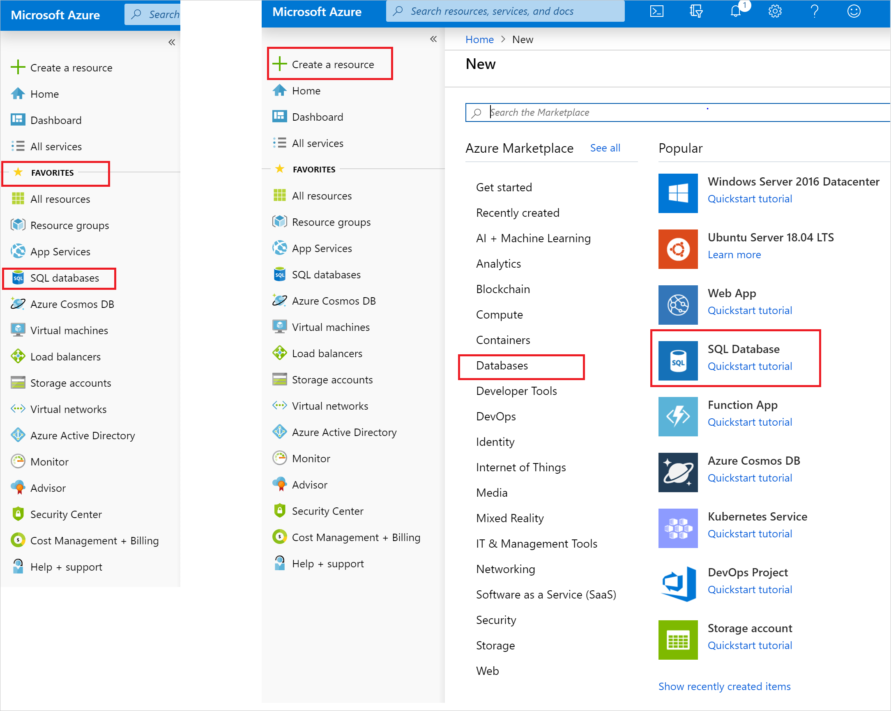
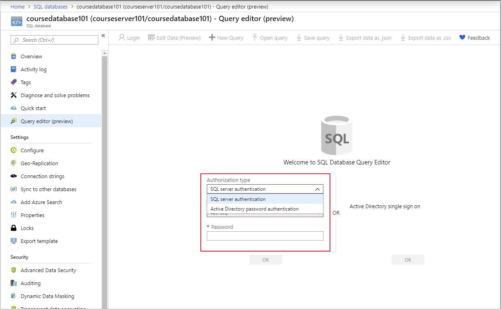

The university needs a location to store data that's currently in text files. They want to make the data relational to improve the ability to access it. They've selected a single database in Azure SQL Database as the storage service for this data. Let's take a look at SQL Database and see how to upload and query data.

## Create a single database by using the Azure portal

SQL Database is a relational database service that's based on the latest stable version of Microsoft SQL Server Database Engine. SQL Database is an easy-to-use, high-performance database that's reliable and highly secure. You can use SQL Database to build new apps, websites, and microservices in the programming language of your choice, and you won't have to manage infrastructure.

You can create a single database through the Azure portal or by using Azure PowerShell or CLI.
- To use the Azure portal, select **SQL databases** under **Favorites**, or select **+Create a resource**, **Databases**, and then **SQL Database**.
- To use CLI, run the **az sql server create** and **az sql db create** commands.
- To use PowerShell, run the **New-AzSqlServer** and **New-AzSqlDatabase** commands.



When you create a single database, you're prompted to specify the server to manage it. You can create a new server or use an existing server.

When you create a new server, you're prompted to specify a server admin user name and password. You'll use these credentials to connect to the server to do administrative tasks and to access the databases that the server controls. SQL Database also supports Azure Active Directory (Azure AD) authentication. But you must always create an admin account when you create a new server and then grant access to accounts that are stored in Azure AD.

Each database server is protected by a firewall to block potentially malicious processes. You can open the firewall to other Azure services. And you can selectively enable access to other computers based on their IP address or address range. SQL Database also provides advanced data security that enables you to:
- Specify the sensitivity of data in individual columns in tables.
- Assess the vulnerability of your databases and take necessary remediation steps.
- Send alerts when a threat is detected.

You provision resources by using the virtual core (vCore) model, which specifies the resources (memory, I/O, and CPU) to allocate. You can scale the compute and storage resources independently. Or, you can assign resources in terms of database transaction units (DTUs). A DTU is a measure of the calibrated cost of the resources that you need to perform a benchmarked transaction.

If you have multiple databases and the resource needs of the databases fluctuate, you can use SQL elastic pool. This feature enables sharing a pool of resources among pooled databases as demand requires.

When you create a database, you also specify how the data will be collated. A *collation* defines the rules that the database uses for sorting and comparing data. It also specifies the character set to use for text data. You can change the collation after you've created the database, but it's best not to change it after the database contains data.

## Create tables

You can use any of these tools to create tables:
- The query editor in the Azure portal
- The `sqlcmd` utility and Cloud Shell
- SQL Server Management Studio

Whichever tool you choose, you define the table by using the `CREATE TABLE` SQL command. SQL Database supports primary keys, foreign keys, indexes, and triggers on tables. The following sample code creates a pair of related tables and a non-clustered index. You can run these commands as a batch in the query editor or in the `sqlcmd` utility.

```SQL
CREATE TABLE MyTable
(
    MyColumn1 INT NOT NULL PRIMARY KEY,
    MyColumn2 VARCHAR(50) NOT NULL
);

CREATE TABLE MyTable2
(
    AnotherColumn1 INT NOT NULL,
    AnotherColumn2 INT NOT NULL REFERENCES MyTable,
    AnotherColumn3 VARCHAR(50) NULL,
    PRIMARY KEY (AnotherColumn1, AnotherColumn2)
);

CREATE INDEX cci ON MyTable2(AnotherColumn3);
```

To access the query editor in the Azure portal, go to the page for your database and select **Query editor**. You'll be prompted for credentials. You can set the **Authorization type** to **SQL Server authentication** and enter the user name and password that you set up when you created the database. Or you can select **Active Directory password authentication** and provide the credentials of an authorized user in Azure AD. If Active Directory single sign-on is enabled, you can connect by using your Azure identity.



You enter your SQL code in the query pane and then click **Run** to execute it. If the SQL statement is a query, any rows that are returned appear in the **Results** pane. The **Messages** pane displays information like the number of rows returned or any errors that occurred:


To use the `sqlcmd` utility, go to Cloud Shell and run the following command. Replace `<server>` with the name of the database server that you created, `<database>` with the name of your database, and `<user name>` and `<password>` with your credentials.

```bash
sqlcmd -S <server>.database.windows.net -d <database> -U <username> -P <password>
```

If the sign-in command succeeds, you'll see a `1>` prompt. You can enter SQL commands on several lines and then type **GO** to run them.

## Bulk import data with bcp

Microsoft provides several tools that you can use to upload data to your SQL database:
- SQL Server Integration Services (SSIS)
- The SQL *BULK INSERT* statement
- The Bulk Copy Program (bcp) utility
 
The `bcp` utility is often used because it's convenient and can be easily scripted to import data into multiple tables. The `bcp` utility is a command-line tool that you can use to import and export data from a database. To import data, `bcp` requires these three things:

- The source data to upload
- An existing table in the destination database
- A *format file* that defines the format of the data and how to map the data to columns in the destination table

The `bcp` utility is flexible. The source data can be in almost any structured format. The format file indicates the layout of the data, whether it's binary or character-based, the type and length of each item, how the data is separated, and so on. The format file also specifies how to map each item in the file to a column in the table. It's important to define the contents of this file correctly. Otherwise, your data might not be imported, or the data might be read into the wrong columns.

Suppose that you have the following data in the file *mydata.csv*, and you want to import this data into the *MyTable* table that we created earlier.

```text
Column1,Column2
some text,99
some more text,101
another bit of text,97
yet more text,87
a final bit of text,33
```

The first line contains field names that aren't the same as the columns in the table. The data is comma-separated, and  each row is terminated by a newline character. Keep in mind that the order of the columns in the file might be different from the table. In this example, the first column in the table is numeric, and the second column is a string, as follows:

```SQL
CREATE TABLE MyTable
(
    MyColumn1 INT NOT NULL PRIMARY KEY,
    MyColumn2 VARCHAR(50) NOT NULL
);
```

You can use the `bcp` command to create a format file for import. The `bcp` command can create a format file based on the schema of the target table in the database. You can then edit the file to match the data in the source file.

Run the following command to create a format file. Replace the items in angle brackets with the values for your database, server, user name, and password:

```bash
bcp <database>.dbo.mytable format nul -c -f mytable.fmt -t, -S <server>.database.windows.net -U <username> -P <password>
```

The `bcp` utility has several parameters that control the functionality of the utility. You can specify:
- The target table (`<database>.<schema>.<table>`)
- The data to be imported and details about the data (`format nul -c -f mytable.fmt -t,`)
- The connection details for your database (`-S <server>.database.windows.net -U <username> -P <password>`)

For full syntax and command-line parameters for the utility, see the [help documentation](https://docs.microsoft.com/sql/tools/bcp-utility?azure-portal=true).

The contents of the *mytable.fmt* format file that's generated by this command look like this:

```text
14.0
2
1       SQLCHAR             0       12      ","    1     MyColumn1                                ""
2       SQLCHAR             0       50      "\n"   2     MyColumn2                                SQL_Latin1_General_CP1_CI_AS
```

The first line shows the internal version number of SQL Database. The second line shows the number of columns in the source table. The final two lines indicate how to map data in the source file to those columns.

Both lines start with a number. These are the column numbers in the table. The second field (SQLCHAR) specifies that when we use this format file to import data, each field in the source file contains character data. The `bcp` utility will try to convert this data to the appropriate type for the corresponding column in the table. The next field (12 and 50) is the length of the data in each column in the database. *Don't change this!* The following items ("," and "\n") are the field terminator in the source file and the newline character, respectively. The next column is the field number in the source file. The second-last field (MyColumn1 and MyColumn2) is the name of the column in the database. The last field is the collation to use, which only applies to character data in the database.

Remember that the fields in the source file are in a different order than the columns in the database. So you should edit the format file and change the field numbers, as shown here:

```text
14.0
2
1       SQLCHAR             0       12      ","    2     MyColumn1                                ""
2       SQLCHAR             0       50      "\n"   1     MyColumn2                                SQL_Latin1_General_CP1_CI_AS
```

The data in field 2 in the source file will be mapped to the first column in the database. Field 1 will be mapped to the second column.

You can now use the `bcp` command to import the data, as follows:

```bash
bcp <database>.dbo.mytable in mydata.csv -f mytable.fmt -S <server>.database.windows.net -U <username> -P <password> -F 2
```

The `in` flag specifies that we're using `bcp` to import data. You can use `out` to transfer data from a database to a file. The `-F 2` flag indicates that the import operation should start at line 2 of the source file. Remember that the first line contains headers rather than data.

The command should run successfully and return messages similar to these examples:

```text
Starting copy...

5 rows copied.
Network packet size (bytes): 4096
Clock Time (ms.) Total     : 46     Average : (108.7 rows per sec.)
```

The important line is "5 rows copied." This reports the number of lines in the source file that contain data that was imported. If this number is different (or 0), your format file may be incorrect.

## Query data

Verify that the import was successful by querying the data. You can use the query editor from the Azure portal. Or you can use the `sqlcmd` utility to connect to the database from a command line. In either case, you run a `SELECT` statement such as this:

```SQL
SELECT *
FROM MyTable;
```

You should see the following results.


