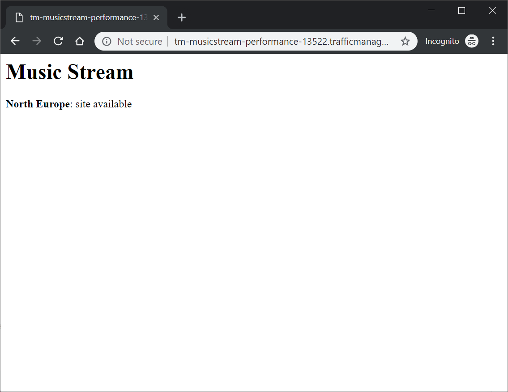

Your network architect would like to take advantage of performance routing to ensure customers have the best performance. They need you to deploy your company's music streaming app to two more regions and configure performance routing.


Now, you'll deploy the application to two more regions. Then, you'll create a new Traffic Manager instance to use all four endpoints.

## Deploy additional instances and configure Traffic Manager

1. Create two new endpoints in Central US and North Europe by deploying the application to new instances of Azure App Service in those regions.

    ```azurecli
    CENTRALAPP="MusicStore-CentralUS-$RANDOM"

    az appservice plan create \
        --resource-group mslearn-trafficmanager  \
        --name MusicStore-CentralUS-Plan \
        --location centralus \
        --sku S1

    az webapp create \
        --resource-group mslearn-trafficmanager \
        --name $CENTRALAPP \
        --plan MusicStore-CentralUS-Plan \
        --runtime "node|10.6" \
        --deployment-source-url https://github.com/MicrosoftDocs/mslearn-distribute-load-with-traffic-manager

    EUROPEAPP="MusicStore-Europe-$RANDOM"

    az appservice plan create \
        --resource-group mslearn-trafficmanager  \
        --name MusicStore-Europe-Plan \
        --location northeurope \
        --sku S1

    az webapp create \
        --resource-group mslearn-trafficmanager \
        --name $EUROPEAPP \
        --plan MusicStore-Europe-Plan \
        --runtime "node|10.6" \
        --deployment-source-url https://github.com/MicrosoftDocs/mslearn-distribute-load-with-traffic-manager
    ```

1. Create a new Traffic Manager profile that is set up with performance routing.

    ```azurecli
        az network traffic-manager profile create \
        --resource-group mslearn-trafficmanager \
        --name TM-MusicStream-Performance \
        --routing-method Performance \
        --unique-dns-name TM-MusicStream-Performance-$RANDOM \
        --output table
    ```

1. Create four new endpoints that can use the deployed four web apps.

    ```azurecli
    CentralId=$(az webapp show \
        --resource-group mslearn-trafficmanager \
        --name $CENTRALAPP \
        --query id \
        --out tsv)

    az network traffic-manager endpoint create \
        --resource-group mslearn-trafficmanager  \
        --profile-name TM-MusicStream-Performance \
        --name "Central-US" \
        --type azureEndpoints \
        --target-resource-id $CentralId

    EuropeId=$(az webapp show \
        --resource-group mslearn-trafficmanager \
        --name $EUROPEAPP \
        --query id \
        --out tsv)

    az network traffic-manager endpoint create \
        --resource-group mslearn-trafficmanager  \
        --profile-name TM-MusicStream-Performance \
        --name "Europe" \
        --type azureEndpoints \
        --target-resource-id $EuropeId

    az network traffic-manager endpoint create \
        --resource-group mslearn-trafficmanager  \
        --profile-name TM-MusicStream-Performance \
        --name "West-US" \
        --type azureEndpoints \
        --target-resource-id $WestId

    az network traffic-manager endpoint create \
        --resource-group mslearn-trafficmanager  \
        --profile-name TM-MusicStream-Performance \
        --name "East-Asia" \
        --type azureEndpoints \
        --target-resource-id $EastId
    ```

## Test the new configuration

1. Go to the Traffic Manager profiles fully qualified domain name (FQDN). Your request is routed to the endpoint that responds with the lowest latency.

    ```bash
    echo http://$(az network traffic-manager profile show \
        --resource-group mslearn-trafficmanager> \
        --name TM-MusicStream-Performance \
        --query dnsConfig.fqdn \
        --output tsv)
    ```

1. Depending on where you're located, you'll be directed to the best performing endpoint.

    

1. Use `nslookup` to resolve the Traffic Manager profile domain name.

    ```bash
    nslookup $(az network traffic-manager profile show \
            --resource-group mslearn-trafficmanager \
            --name TM-MusicStream-Performance \
            --query dnsConfig.fqdn \
            --output tsv)
    ```

    The `nslookup` command returns where the domain name resolves. For example, if you're closest to Europe, it returns the following.

    ```output
    Non-authoritative answer:
    tm-musicstream-performance-13522.trafficmanager.net
    canonical name = musicstore-europe-23644.azurewebsites.net.

    musicstore-europe-23644.azurewebsites.net
    canonical name = waws-prod-db3-129.sip.azurewebsites.windows.net.

    waws-prod-db3-129.sip.azurewebsites.windows.net
    canonical name = waws-prod-db3-129.cloudapp.net.

    Name:   waws-prod-db3-129.cloudapp.net
    Address: 23.100.56.27
    ```

If your customers have two endpoints that have equal network latency, they might be routed to either endpoint. Refresh the web page to see if you are served the same endpoint.
