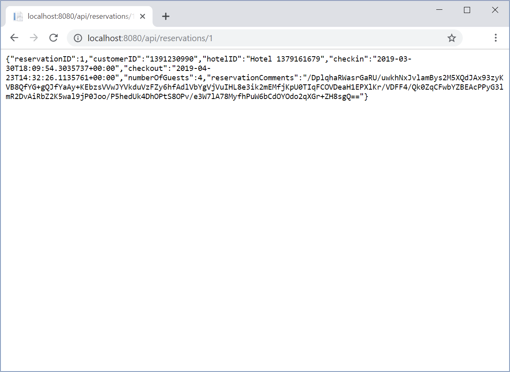

A Dockerfile contains the steps for building a custom Docker image.

You now decide to deploy one of your organization's web apps using Docker. You select a simple web app that implements a web API for a hotel reservations web site. The web API exposes HTTP POST and GET operations that create and retrieve customer's bookings.

> [!NOTE]
> In this version of the web app, the bookings are not actually persisted, and queries return dummy data.

In this exercise, you'll create a Dockerfile for an app that doesn't have one. Then, you'll build the image and run it locally.

## Create a Dockerfile for the web app

1. In a command prompt window on your local computer, run the following command to download the source code for the web app.

    ```bash
    git clone https://github.com/MicrosoftDocs/mslearn-hotel-reservation-system.git
    ```

2. Move to the `src` folder.

    ```bash
    cd mslearn-hotel-reservation-system/src
    ```

3. In this directory, create a new file named `Dockerfile` with no file extension and open it in a text editor. On Windows, you can run the following commands:

    ```bash
    copy NUL Dockerfile
    notepad Dockerfile
    ```

4. Add the following commands to the Dockerfile. These commands fetch an image containing the .NET Core Framework SDK. The project files for the web app (`HotelReservationSystem.csproj`) and the library project (`HotelReservationSystemTypes.csproj`) are copied to the /src folder in the container. The `*`dotnet restore`*` command downloads the dependencies required by these projects from NuGet.

    ```Dockerfile
    FROM mcr.microsoft.com/dotnet/core/sdk:2.2
    WORKDIR /src
    COPY ["HotelReservationSystem/HotelReservationSystem.csproj", "HotelReservationSystem/"]
    COPY ["HotelReservationSystemTypes/HotelReservationSystemTypes.csproj", "HotelReservationSystemTypes/"]
    RUN dotnet restore "HotelReservationSystem/HotelReservationSystem.csproj"
    ```

5. Append the following commands to the Dockerfile. These commands copy the source code for the web app to the container and then run the dotnet build command to build the app. The resulting DLLs are written to the /app folder in the container.

    ```Dockerfile
    COPY . .
    WORKDIR "/src/HotelReservationSystem"
    RUN dotnet build "HotelReservationSystem.csproj" -c Release -o /app
    ```

6. Add the following command to the Dockerfile. The `dotnet publish` command copies the executables for the web site to a new folder and removes any interim files. The files in this folder can then be deployed to a web site.

    ```Dockerfile
    RUN dotnet publish "HotelReservationSystem.csproj" -c Release -o /app
    ```

7. Add the following commands to the Dockerfile. The first command opens port 80 in the container. The second command moves to the `/app` folder containing the published version of the web app. The final command specifies that when the container runs it should execute the command `dotnet HotelReservationSystem.dll`. This library contains the compiled code for the web app

    ```Dockerfile
    EXPOSE 80
    WORKDIR /app
    ENTRYPOINT ["dotnet", "HotelReservationSystem.dll"]
    ```

8. Save the file and close your text editor.

## Build and deploy the image using the Dockerfile

1. At the command prompt, run the following command to build the image for the sample app using the Dockerfile. Don't forget the `.` at the end of the command. This command builds the image and stores it locally. The image is given the name `reservationsystem`. Verify that the image is built successfully. A warning about file and directory permissions will be displayed when the process completes. You can ignore these warnings for the purposes of this exercise.

    ```bash
    docker build -t reservationsystem .
    ```

1. Run the following command to verify that the image has been created and stored in the local registry. 

    ```bash
    docker image list
    ```

    The image will have the name `reservationsystem`. You'll also see an image named *microsoft/dotnet*. This image contains the .NET Core SDK and was downloaded when the `reservationsystem` image was built using the Dockerfile.

    ```console
    REPOSITORY          TAG                 IMAGE ID            CREATED              SIZE
    reservationsystem   latest              d2501f0f2ced        About a minute ago   1.76GB
    microsoft/dotnet    2.1-sdk             c17aa78d71c2        8 days ago           1.73GB
    ```

## Test the web app

1. Run a container using the `reservationsystem` image using the following command. Docker will respond with a lengthy string of hex digits – the container runs in the background without any UI. Port 80 in the container is mapped to port 8080 on the host machine. The container is named `reservations`.

    ```bash
    docker run -p 8080:80 -d --name reservations reservationsystem
    ```

1. Start a web browser and navigate to http://localhost:8080/api/reservations/1. You should see a JSON document containing the data for reservation number 1 returned by the web app. You can replace the "1" with any reservation number, and you'll see the corresponding reservation details.

    

1. Examine the status of the container using the following command.

    ```bash
    docker ps -a
    ```

     Verify that the status of the container is *Up*.

    ```console
    CONTAINER ID        IMAGE               COMMAND                  CREATED             STATUS              PORTS                  NAMES
    07b0d1de4db7        reservationsystem   "dotnet HotelReserva…"   5 minutes ago       Up 5 minutes        0.0.0.0:8080->80/tcp   reservations
    ```

1. Stop the *reservations* container with the following command.

    ```bash
    docker container stop reservations
    ```

1. Delete the *reservations* container from the local registry.

    ```bash
    docker rm reservations
    ```

1. Leave the *reservationsystem* in the local registry. You will use this image in the next exercise.

You've now created an image for your web app and run it using a Docker container.
