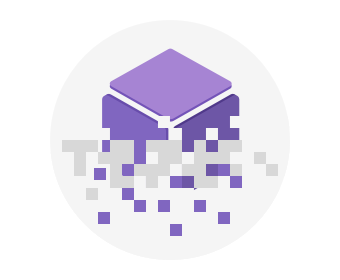
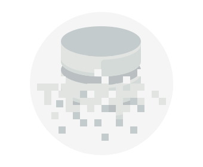

For most organizations, data is the most valuable and irreplaceable asset. Encryption serves as the last and strongest line of defense in a layered security strategy. 

Contoso Shipping knows that encryption is the only protection its data has once it leaves the data center and is stored on mobile devices that could potentially be hacked or stolen.

## What is encryption?

Encryption is the process of making data unreadable and unusable to unauthorized viewers. To use or read the encrypted data, it must be *decrypted*, which requires the use of a secret key. There are two top-level types of encryption: **symmetric** and **asymmetric**.

**Symmetric encryption** uses the same key to encrypt and decrypt the data. Consider a desktop password manager application. You enter your passwords and they are encrypted with your own personal key (your key is often derived from your master password). When the data needs to be retrieved, the same key is used, and the data is decrypted.

**Asymmetric encryption** uses a public key and private key pair. Either key can encrypt but a single key can't decrypt its own encrypted data. To decrypt, you need the paired key. Asymmetric encryption is used for things like Transport Layer Security (TLS) (used in HTTPS) and data signing.

Both symmetric and asymmetric encryption play a role in properly securing your data. Encryption is typically approached in two ways: 

1. Encryption at rest
1. Encryption in transit

## Encryption at rest

Data at rest is the data that has been stored on a physical medium. This could be data stored on the disk of a server, data stored in a database, or data stored in a storage account. Regardless of the storage mechanism, encryption of data at rest ensures that the stored data is unreadable without the keys and secrets needed to decrypt it. If an attacker was to obtain a hard drive with encrypted data and did not have access to the encryption keys, the attacker would not compromise the data without great difficulty.

The actual data that is encrypted could vary in its content, usage, and importance to the organization. This could be financial information critical to the business, intellectual property that has been developed by the business, personal data about customers or employees that the business stores, and even the keys and secrets used for the encryption of the data itself.

Here's a diagram that shows what encrypted customer data might look like as it sits in a database.

## Encryption in transit

Data in transit is the data actively moving from one location to another, such as across the internet or through a private network. Secure transfer can be handled by several different layers. It could be done by encrypting the data at the application layer prior to sending it over a network. HTTPS is an example of application layer in transit encryption.

You can also set up a secure channel, like a virtual private network (VPN), at a network layer, to transmit data between two systems.

Encrypting data in transit protects the data from outside observers and provides a mechanism to transmit data while limiting risk of exposure.

This diagram shows the process. Here, customer data is encrypted as it's sent over the network. Only the receiver has the secret key that can decrypt the data to a usable form.

## Encryption on Azure

Let's take a look at some ways that Azure enables you to encrypt data across services.

:::row:::
  :::column:::
    
  :::column-end:::
	:::column span="3":::  
**Encrypt raw storage**

**Azure Storage Service Encryption** for data at rest helps you protect your data to meet your organizational security and compliance commitments. With this feature, the Azure storage platform automatically encrypts your data before persisting it to Azure Managed Disks, Azure Blob storage, Azure Files, or Azure Queue storage, and decrypts the data before retrieval. The handling of encryption, encryption at rest, decryption, and key management in Storage Service Encryption is transparent to applications using the services.

  :::column-end:::
:::row-end:::

:::row:::
  :::column:::
    
  :::column-end:::
	:::column span="3":::  
**Encrypt virtual machine disks**

Storage Service Encryption provides low-level encryption protection for data written to physical disk, but how do you protect the virtual hard disks (VHDs) of virtual machines? If malicious attackers gained access to your Azure subscription and got the VHDs of your virtual machines, how would you ensure they would be unable to access the stored data?
  :::column-end:::
:::row-end:::

**Azure Disk Encryption** is a capability that helps you encrypt your Windows and Linux IaaS virtual machine disks. Azure Disk Encryption leverages the industry-standard BitLocker feature of Windows and the dm-crypt feature of Linux to provide volume encryption for the OS and data disks. The solution is integrated with Azure Key Vault to help you control and manage the disk encryption keys and secrets (and you can use managed service identities for accessing Key Vault).

For Contoso Shipping, using VMs was one of the first moves toward the cloud. Having all the VHDs encrypted is a very easy, low-impact way to ensure that you are doing all you can to secure your company's data.

:::row:::
  :::column:::
    
  :::column-end:::
	:::column span="3":::  
**Encrypt databases**

**Transparent data encryption (TDE)** helps protect Azure SQL Database and Azure Data Warehouse against the threat of malicious activity. It performs real-time encryption and decryption of the database, associated backups, and transaction log files at rest without requiring changes to the application. By default, TDE is enabled for all newly deployed Azure SQL Database instances.

  :::column-end:::
:::row-end:::

TDE encrypts the storage of an entire database by using a symmetric key called the database encryption key. By default, Azure provides a unique encryption key per logical SQL Server instance and handles all the details. Bring your own key (BYOK) is also supported with keys stored in Azure Key Vault (see below).

Because TDE is enabled by default, you are confident that Contoso Shipping has the proper protections in place for data stored in the company's databases.

:::row:::
  :::column:::
    
  :::column-end:::
	:::column span="3":::  
**Encrypt secrets**

We've seen that the encryption services all use keys to encrypt and decrypt data, so how do we ensure that the keys themselves are secure? Corporations may also have passwords, connection strings, or other sensitive pieces of information that they need to securely store. In Azure, we can use **Azure Key Vault** to protect our secrets.

  :::column-end:::
:::row-end:::

Azure Key Vault is a centralized cloud service for storing your application secrets. Key Vault helps you control your applications' secrets by keeping them in a single, central location and by providing secure access, permissions control, and access logging capabilities. It is useful for a variety of scenarios:

- *Secrets management*. You can use Key Vault to securely store and tightly control access to tokens, passwords, certificates, *Application Programming Interface* (API) keys, and other secrets.
- *Key management*. You also can use Key Vault as a key management solution. Key Vault makes it easier to create and control the encryption keys used to encrypt your data.
- *Certificate management*. Key Vault lets you provision, manage, and deploy your public and private *Secure Sockets Layer/ Transport Layer Security* (SSL/ TLS) certificates for your Azure, and internally connected, resources more easily.
- *Store secrets backed by hardware security modules* (HSMs). The secrets and keys can be protected either by software, or by FIPS 140-2 Level 2 validated HSMs.

The benefits of using Key Vault include:

- *Centralized application secrets*. Centralizing storage for application secrets allows you to control their distribution, and reduces the chances that secrets may be accidentally leaked.
- *Securely stored secrets and keys*. Azure uses industry-standard algorithms, key lengths, and HSMs, and access requires proper authentication and authorization.
- *Monitor access and use*. Using Key Vault, you can monitor and control access to company secrets.
- *Simplified administration of application secrets*. Key Vault makes it easier to enroll and renew certificates from public Certificate Authorities (CAs). You can also scale up and replicate content within regions, and use standard certificate management tools.
- *Integrate with other Azure services*. You can integrate Key Vault with storage accounts, container registries, event hubs and many more Azure services.

Because Azure AD identities can be granted access to use Azure Key Vault secrets, applications with managed service identities enabled can automatically and seamlessly acquire the secrets they need.

## Summary

As you may know, encryption is often the last layer of defense from attackers and is an important piece of a layered approach to securing your systems. Azure provides built-in capabilities and services to encrypt and protect data from unintended exposure. Protection of customer data stored within Azure services is of paramount importance to Microsoft and should be included in any design. Foundational services such as Azure Storage, Azure Virtual Machines, Azure SQL Database, and Azure Key Vault can help secure your environment through encryption.
