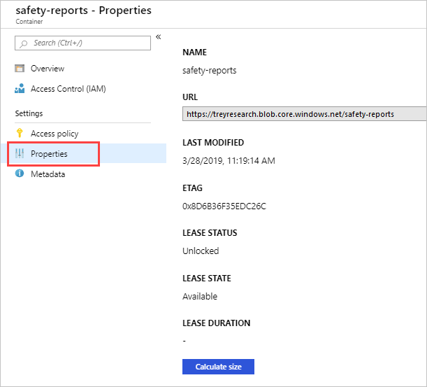
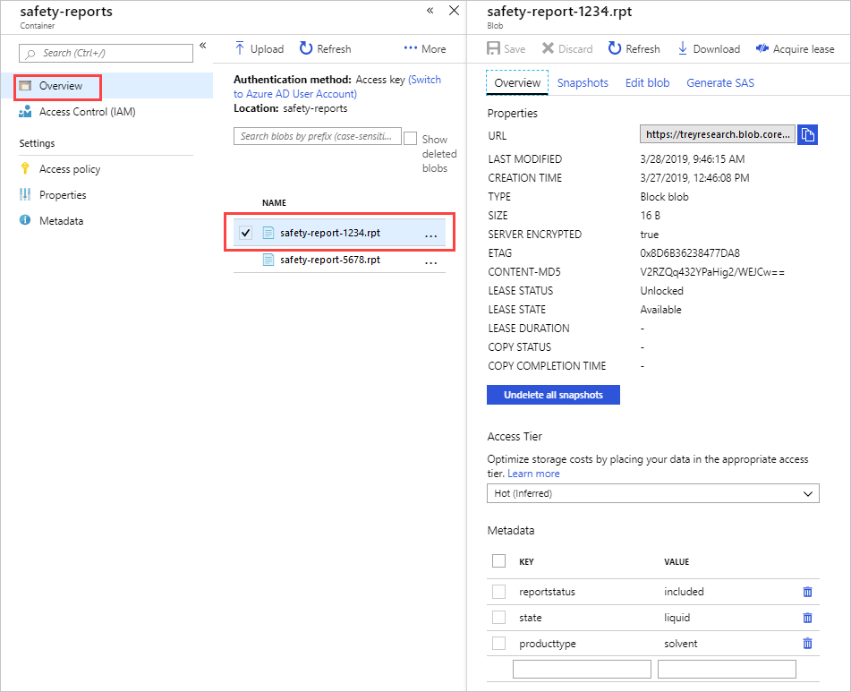

As lead developer for Trey Research, you are planning to develop a web app to manage and organize your blob data, and you want to understand the methods that you can use in your code for retrieving blob properties and metadata. During the development phase for your app, you'd also like to be able to quickly check this data using command line and GUI tools, so you need to know what tools can be used and how to use them.

There several ways to retrieve properties and metadata:

- Using the Azure portal (GUI)
- Using the command line
- Programatically (via code)
 
In this unit, you'll review techniques for retrieving the data and the steps that are required to implement this functionality, and in the next unit you will use this knowledge to create an Azure Storage account and retrieve properties.

## Azure portal

Using the Azure portal, you can view container and blob properties, and any metadata.

1. Sign in to the [Azure portal](https://portal.azure.com), and click **Storage Accounts**.

1. Under **Blob service**, click **Blobs** and select a container.

   

1. On the left, click **Properties**.

   

1. You can now view the properties of the container.

   

1. On the left, click **Metadata**.

1. You can now view any metadata for the container.

   

1. On the left, click **Overview**.

1. Click a blob.

1. You can now view the properties and metadata for that blob.

   

## Azure Powershell

You can use Powershell to view properties and metadata for containers and Blobs. Some of the main cmdlets you need are:

```powershell
Get-AzStorageContext

Get-AzStorageBlob

Get-AzStorageContainer
```

Here's an example command for viewing properties and metadata for a blob called **hazard-tests.docx**, and for the blob's parent container called **safety-reports**:

```powershell
$Storage = "<StorageAccountName>"

$Key = "<StorageAccountKey>"

$ContainerName = "safety-reports"

$BlobName = "hazard-tests.docx"

$Context = New-AzStorageContext -StorageAccountName $Storage -StorageAccountKey $Key

$Blob = Get-AzStorageBlob -Context $Context -Container $ContainerName -Blob $BlobName

$Container = Get-AzStorageContainer -Context $Context -Container $ContainerName

# View basic properties of the container
Write-Host "Container name = " $Container.Name 

# View more detailed properties of the container
Write-Host "Container Uri = " $Container.CloudBlobContainer.Uri 

# View container metadata
Write-Host "Container metadata = " $Container.CloudBlobContainer.Metadata 

# View basic properties of the blob:
Write-Host "blob type = " $Blob.BlobType 
Write-Host "blob name = " $Blob.Name 
Write-Host "Last modified on = " $Blob.LastModified

# View more detailed properties of the blob:
Write-Host "Etag = " $Blob.ICloudBlob.Properties.Etag 

# View blob metadata:
Write-Host "Metadata = " $Blob.ICloudBlob.Metadata 
```

## Azure CLI

You can also use Azure CLI to view properties and metadata for blobs and containers. Below are some main cmdlets you can use:

```azurecli
# Lists properties of a blob
az storage blob show

# Lists properties of a container
az storage container show 

# Displays metadata for a blob
az storage blob metadata show

# Displays metadata for a container 
az storage container metadata show
```
The following command will display the properties of a container called **safety-reports**, in the **treyresearch** storage account:

```azurecli
az storage container show \
--name safety-reports \
--account-name treyresearch \
--output table
```

The following command will display the properties of a blob called **hazard-tests.docx**:

```azurecli
az storage blob show \
--container-name safety-reports \
--name hazard-tests.docx \
--account-name treyresearch \
--output table
```

The following command will display the metadata that is stored for the **safety-reports** container:

```azurecli
az storage container metadata show \
--name safety-reports \
--account-name treyresearch 
```

The following command will display the metadata that is stored for the **hazard-tests.docx** blob:

```azurecli
az storage blob metadata show \
--container-name safety-reports \
--name hazard-tests.docx \
--account-name treyresearch 
```

## C# (.NET)

In the .NET client SDK, a Block blob is referred to as a `CloudBlockBlob`, and a container as a `CloudBlobContainer` object.

In your project, import the `Microsoft.Azure.Storage.Blob` package using NuGet.

Add the following `using` directives to your code:

```csharp
using Microsoft.WindowsAzure.Storage;

using Microsoft.WindowsAzure.Storage.Blob;
```

The Azure SDK enables you to view properties and metadata for a `CloudBlockBlob` or a `CloudBlobContainer` object using the `FetchAttributesAsync` method. 

The following code shows how to use the `FetchAttributesAsync` method to display metadata:

```csharp
public static async Task ListContainerMetadataAsync(CloudBlobContainer container)
{
    // Fetch container attributes in order to populate the container's properties and metadata.
    await container.FetchAttributesAsync();

    // Enumerate the container's metadata.
    Console.WriteLine("Container metadata:");
    foreach (var metadataItem in container.Metadata)
    {
        Console.WriteLine("\tKey: {0}", metadataItem.Key);
        Console.WriteLine("\tValue: {0}", metadataItem.Value);
    }
}
```

## REST

Using the REST API you can retrieve properties and metadata using HTTP GET and HEAD requests. (For HTTP HEAD requests, only a response headers are returned - not the contents of the blob. This is useful when testing request syntax before retrieving blobs.)

For a container, use this syntax:
```
GET/HEAD https://myaccount.blob.core.windows.net/mycontainer?restype=container
```

For a blob, use this syntax:
```
GET/HEAD https://myaccount.blob.core.windows.net/mycontainer/myblob?comp=metadata
```

In the next unit, you will use the knowledge you have gained in this unit to create an Azure Storage account and retrieve properties.
