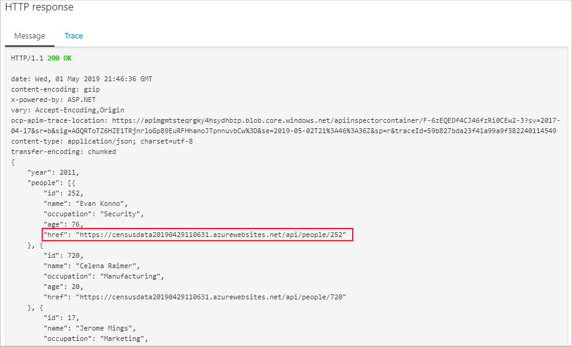

Organizations may need to adjust the information that an API publishes at short notice, for example, to comply with a change of legislation or address a new security threat.

The Government census API exposes details about the URL from which the API is being called from. This information could allow a malicious user to attempt to access the census data by bypassing the API Management gateway and exposing a less secure endpoint. As lead developer, you want to mask these URLs within the response body of the API.

Here, you will learn how to use API Management policies that manipulate the content of API response headers and bodies.

## Why transform a response?

The response body of an API call contains the data that is being requested. In the Census API, for example, the response body contains the JSON data for the respondents. You can also see how the body contains URL links to view individual people:

These links are based on the Census API endpoints and need to be masked to show the API Management URLs instead.

To achieve this configuration, we will create a transformation policy.

> [!NOTE]
> It's best practice to secure the backend API by configuring it to require a client certificate and then configuring API Management to supply that certificate. It this configuration, no one can call the backend API directly and circumvent your API Management gateway because they don't have a certificate that's recognized by the backend.

## Transformation policy

A transformation policy modifies the content of an API call. Some transformation policies apply to the header and others apply to the body. The following transforms are available:

| Transform | Detail |
| ---------|--------- |
| **Convert JSON to XML** | Converts a request or response body from JSON to XML. |
| **Convert XML to JSON** | Converts a request or response body from XML to JSON. |
| **Find and replace string in body** | Finds a request or response substring and replaces it with a different substring. |
| **Mask URLs in content** | Rewrites links in the response body so that they point to the equivalent link through the gateway. |
|**Set backend service** | Changes the backend service for an incoming request. |
|**Set body** | Sets the message body for incoming and outgoing requests. |
| **Set HTTP header** | Assigns a value to an existing response or request header, or adds a new response or request header. |
| **Set query string parameter** | Adds, replaces the value of, or deletes a request query string parameter. |
| **Rewrite URL** | Converts a request URL from its public form to the form expected by the web service. |
| **Transform XML using an XSLT** | Applies an XSL transformation to the XML in the request or response body. |
| | |

You will use the **Mask URLs in Content** transform to alter the links in the following exercise.
