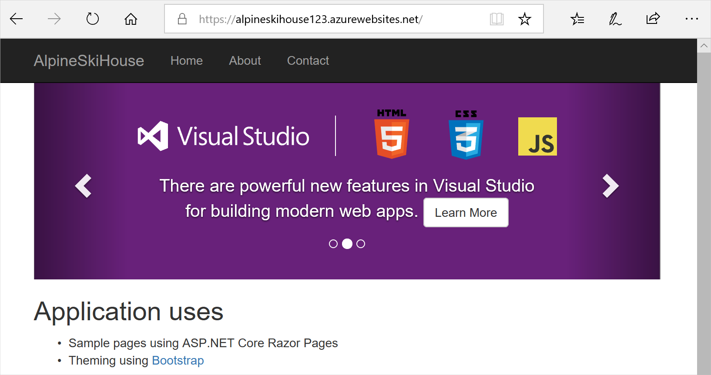

You now have an ASP.NET Core web application running locally. In this part, you'll publish your application to Azure App Service.

1. In Solution Explorer, right-click your project and select **Publish**.

1. Click **Start**.

1. In the dialog box that appears, on the left, choose **App Service** as your publish target.  On the right, select **Create New** to create an App Service app.

1. Click **Publish**.

### Configure your new Azure App Service

1. In the **Create App Service** dialog box, click **Add an account**, and sign in to Azure.

1. Enter the required information about your App Service plan.

    In the **Create App Service** dialog box, provide the following information:

    - **App Name**: the name of your application.  The name determines the URL of the published application, which will be https://&lt;AppName&gt;.azurewebsites.net. It must be a unique value. You may have to try out some different names to find one that is unique.

    - **Subscription**: The Azure subscription you wish to deploy the app to. Choose **Concierge Subscription**, which we provide to you through the sandbox.

    - **Resource Group:** Select the existing <rgn>[sandbox resource group name]</rgn> resource group.

    - **Hosting Plan:** The hosting plan specifies the location, size, and features of the web server farm that hosts your app.  For this exercise, create a new hosting plan.

        Click the **New...** button next to the hosting plan. In the Configure Hosting Plan window that appears, change the **Size** to **Free** and click OK.

    - **Application Insights:** Specifies if you want to use Application Insights for your application. For this exercise, we recommend that you choose **None.**

1. Click the **Create** button to start publishing your app. You will see progress as it deploys.

1. Congratulations, your ASP.NET Core web application is now published and live. The final URL for your site in the build output and also on the publishing page in Visual Studio.

1. To test your website, go to the URL indicated.

    

    > [!NOTE]
    > If you can't locate the URL from the output, navigate to https://&lt;AppName&gt;.azurewebsites.net, where &lt;AppName&gt; is the name you provided earlier. For example, **https://alpineskihouse123.azurewebsites.net/**.

You now have a live web app! Your Azure App Service plan has been created, and the app is running, and ready to accept updates.
  