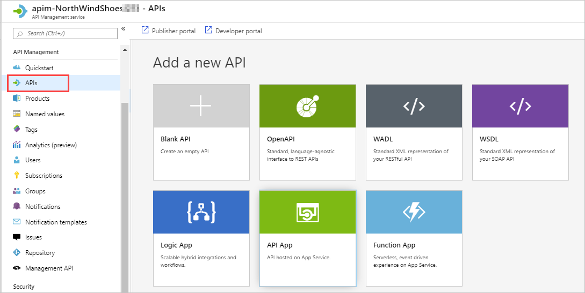
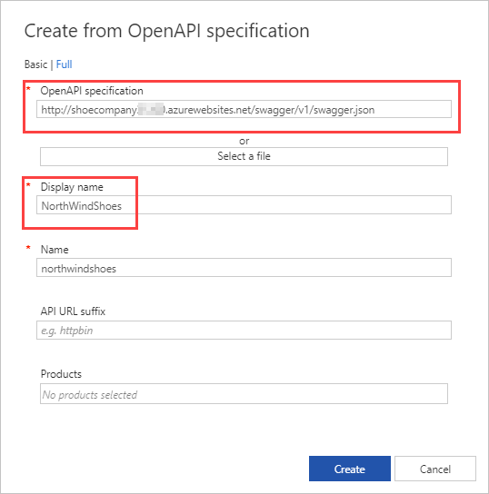
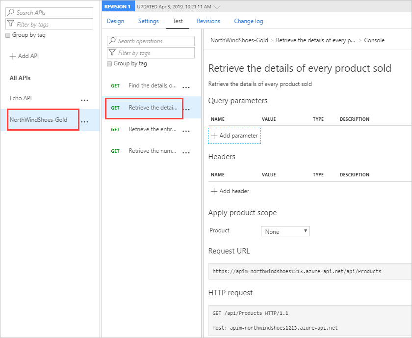
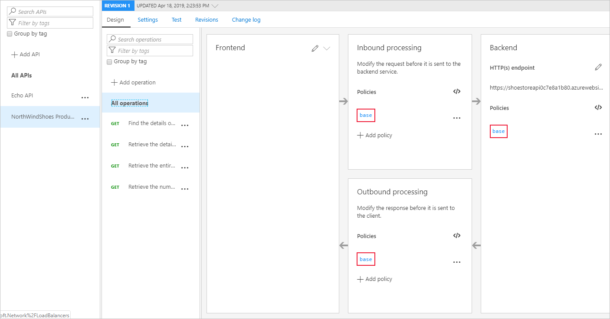
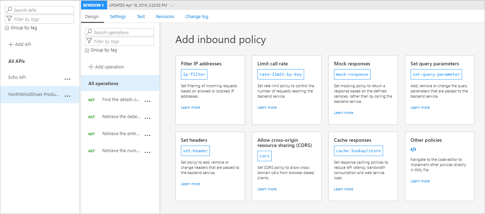

To make an API available through an API gateway, you need to import and publish the API.

In the shoe company example, NorthWind Shoes wants to enable selected partners to be able to query inventory and stock levels.

Here, you'll learn how to import an API into Azure API Management, and how to make an API available to clients.

## API

An API is a standardized way for organizations to expose specific data to potential developers or partners. For example, in the previous exercise you created an API to share information about products and inventory.

Making an API available starts with importing the API into API Management. You can then:

- Use the visualization tools in the API gateway to test out your API.
- Manage access to your APIs using policies.

## API frameworks
There are various API frameworks and standards. API Management provides you with several options for importing APIs.

|Type  |Details |
|---------|---------|
|**Blank API**|You can import an API with a blank API definition. You then manually specify all the required parameters. |
|**Open API**|Open API is a specification that documents all the endpoints and operations for RESTful APIs, and all input and output parameters. OpenAPI was originally called Swagger.|
|**WADL**| Web Application Description Language is an XML description of HTTP-based web services. It is a simpler format and more lightweight than WSDL.|
|**WSDL**| Web Service Description Language is an XML description of any network service, not just HTTP.|
|**Logic App**| Logic apps are used to orchestrate and automate workflows and integrations with various data sources.|
|**API App**|An API hosted within an API app service in Azure.|
|**Function App**|Serverless code that can be called through triggers.|

## Import an API
There are several ways to import an API into Azure API Management.

Using the Azure portal, you select **APIs**, and then **+ Add API**. You start by selecting the API framework you'd like to import.

You then provide a link to your API specification as a URL or file, and a name for the API. Here's an example for an OpenAPI import.

The Azure portal is not the most efficient tool for importing and configuring large numbers of APIs. As you scale up your API management, you'll need other tools. You can use **Azure PowerShell** to manage your API gateway, and to import APIs. There are cmdlets for deploying API gateways, defining and configuring products, importing APIs, and managing users and subscriptions.

## Visualize
You can use the API gateway as a way to visualize how data is processed through your imported APIs. You can interact with datasets, and pass parameters through your APIs.

If you are an administrator, you can visualize APIs in the Azure portal.

## Policies
Policies provide powerful capabilities to change the behavior of an API through configuration. They exist as a collection of statements that are executed sequentially on the request or response of an API.

Popular configurations include:

- Conversion from XML to JSON
- Call rate limiting to restrict the number of incoming calls.
- Setting inbound and outbound headers

You use the Azure portal to apply different policies to APIs. 
Policies can be viewed in the **Design** tab.

You can also use the Design tab to add new policies.

## Product

A product is a collection of APIs. You can assign APIs to more than one product. For example, you might want one product, **NorthWindShoesPartners**, to expose two APIs for your partners:

|Product  |NorthWindShoesPartners |
|---------|---------|
|API 1     |    **Inventory**     |
|API 2     |  **Planning**       |

For your suppliers, you might only want to expose one API:

|Product  |NorthWindShoesSuppliers |
|---------|---------|
|API 1     |    **Inventory**     |
|API 2     |         |

You assign policies so that your products can have different access rules, usage quotas, and terms of use. So if you want your partners and suppliers to have different access rights to your **Inventory** API, assign the API to two different products.

You use the Azure portal to associate APIs with a product.

For all pricing tiers except consumption, there two default products: **Starter** and **Unlimited**. The Unlimited product is designed for production API management, as it has no restrictions on the number of attached APIs. You can create as many new products as you need. The starter product has a limit of five API calls/minute, and a maximum of 100 API calls/week.
