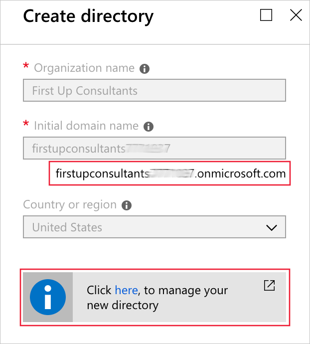
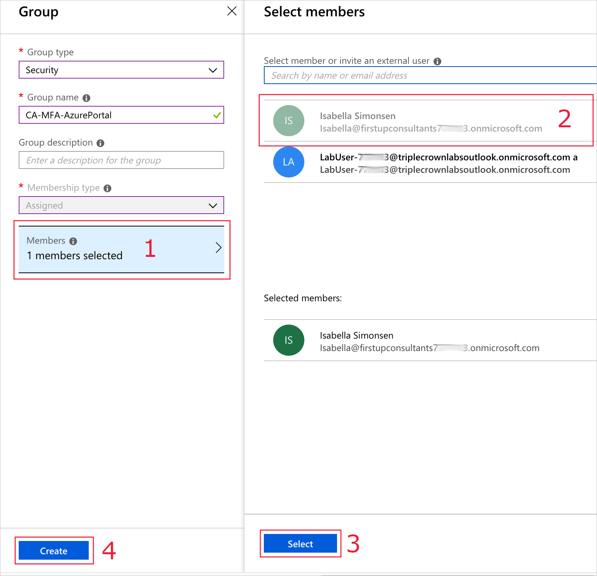

> [!NOTE]
> This exercise is optional. You may complete the steps below in your own account. Charges may occur.

You decide to deploy Azure AD and use conditional access policies that Azure require Multi-Factor Authentication when anyone accesses the Azure portal. You need to create a directory and get temporary licenses in place.

## Create a directory

You will create a new Active Directory for First Up Consultants in the Sandbox Portal, where you can test without fear of impacting production users. 

1. log into the [Azure portal](https://portal.azure.com?azure-portal=true).

1. In the left navigation pane, click **Create a resource** > **Identity** > **Azure Active Directory**.

1. In the **Create directory** blade, provide the following values for the **Organization name** and **Initial domain name**:

   1. Organization Name: `First Up Consultants`.
   2. Initial Domain Name: `firstupconsultants<XXXXXXX>` where XXXXXXX is a word or number you add to give the domain a unique name.
   3. Tap the **Create** button.

1. Wait for the directory to be created. Make a note of the full domain name, as shown below. Click the link to switch to the new directory.

## Create a test user

We're going to need to test this out with a user. Isabella Simonsen (another member of your team) has volunteered to help you out. She will need an account in the directory, so we will go through the steps to create her account.

1. Browse to **Azure Active Directory** > **Users**.

1. Click **New user**.

1. Create a user named **Isabella Simonsen** with a user name of:

   `Isabella@firstupconsultants<XXXXXXX>.onmicrosoft.com`

   Match the domain after the @ with the domain you created and noted in the *Create a directory* section above.

1. Check the box to **Show Password** for the user. Make a note of the password so you can use it later when testing.

1. Click **Create**.

## Create a pilot group

We will be assigning the policy that we create to a group of users, but we need to create a group for this policy. The following steps help you create a security group for the pilot deployment.

1. Browse to **Azure Active Directory** > **Groups**.

1. Click **New group**.

1. Group type **Security**.

1. Group name **CA-MFA-AzurePortal**.

1. Membership type **Assigned** and click the Members link (labeled "1" in the diagram below).

1. Select the user that we created in the previous step (labeled "2" in the diagram below) and choose **Select** (labeled "3).

1. Click **Create** (labeled "4" in the diagram below).

In this unit, you learned how to create a trial licensed directory, a test user, and a pilot group in the Azure portal.