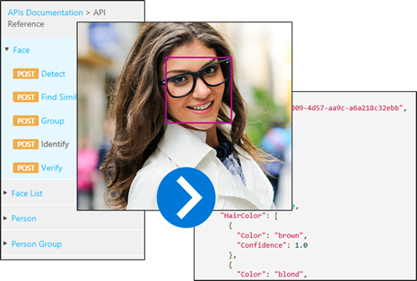

The Face API provides algorithms, exposed as REST-based web service calls, to detect, verify, identify, and analyze faces. The service can provide face matching, face attributes, and characteristic analysis. The Face API can also organize people and facial definitions into groups to locate similar faces.

The Face API tasks fall into five categories:

* **Verification**: Check the likelihood that two faces belong to the same person.
* **Detection**: Detect human faces in an image.
* **Identification**: Search and identify faces.
* **Similarity**: Find similar faces.
* **Grouping**: Organize unidentified faces into groups, based on their visual similarity.

The Face API uses artificial intelligence to:

- Detect human activity in images.
- Attempt to match faces to existing image databases.
- Detect human faces and return their coordinates.
- Manage profiles based on face attributes.
- Analyze and identify faces in video frames.