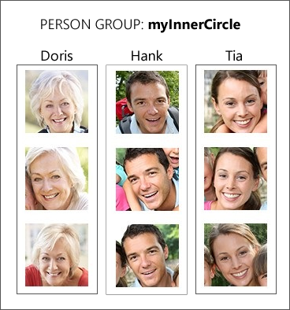
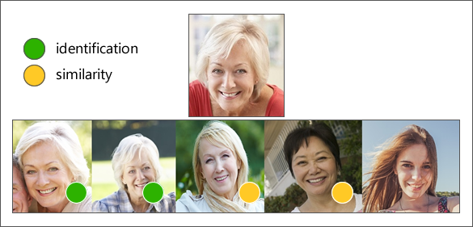

Strictly speaking, a _face list_ is a group of faces. Create and manage face lists to find similar faces in a fixed collection of faces. For example, you could use a face list to find a similar face in a set of pictures of celebrities, friends, or family members.

A face list relates to several concepts:

- **Face**: A single face
- **Face list**: A list or collection of faces
- **Person**: A single person
- **Person group**: A list or collection of persons

Relationships among these terms can get a little fuzzy, so it's helpful to visualize them:

Face lists are useful when you're working on face *identification* and face *similarity*.

## Face identification

You can use the Face API to identify people by comparing a detected face to a person group. Remember, a person group is like a database of people. For example, you might create a person group named *myInnerCircle*:  

You can use a different face to perform identification against the person group. If the face is identified as a person in the group, the person object is returned as a match.

## Face similarity

Face lists are a great way to determine _face similarity_. For example, if you compare a target face against a face list, the Face API might return a small collection of faces that look similar to the target face. The Face API supports two working modes: match face and match person.

- **Match person** returns similar faces after applying a same-person threshold that's derived from face verification.
- **Match face** returns similar faces by ignoring the same-person threshold.

In the following image, face similarity would find that the first and second faces are the same person. It would find that the third and fourth faces are similar.

## Collection capacity

Although you probably won't hit a collection threshold, you might want to know the capacities for Face API storage collections:

- **Face list**: Up to 1,000 distinct faces
- **Person group**: Up to 10,000 persons
- **Person**: Up to 248 faces

That's a lot to digest. But you'll likely find that working with the Face API is a breeze when these concepts sink in.
