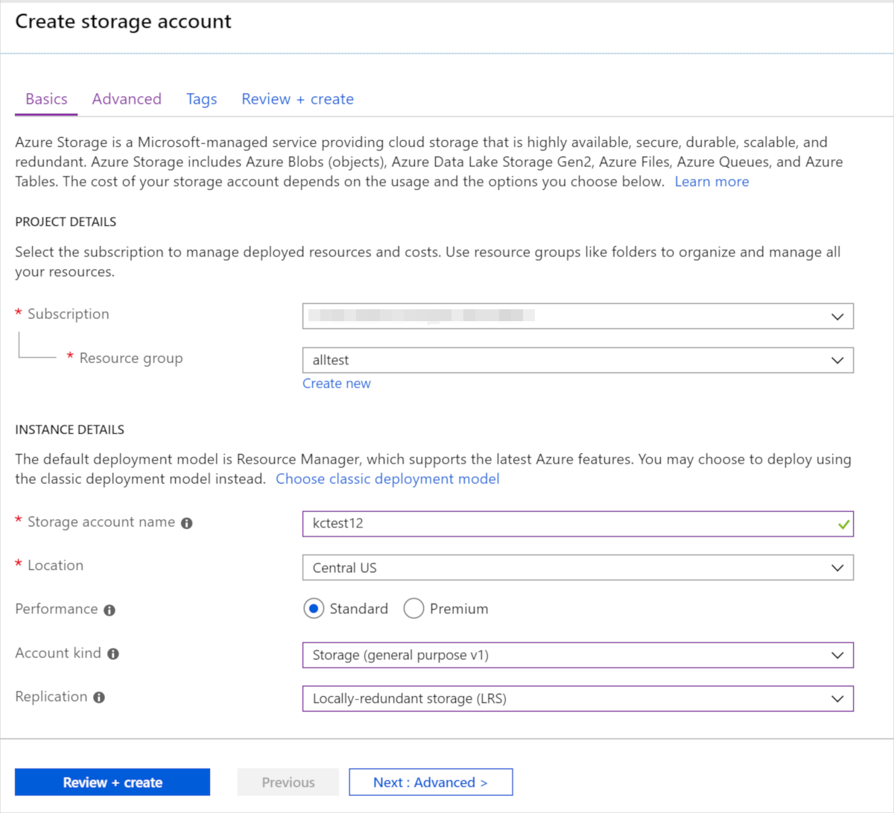
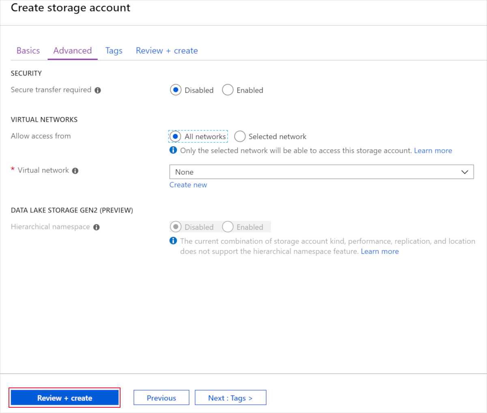
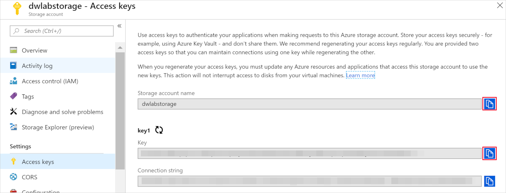
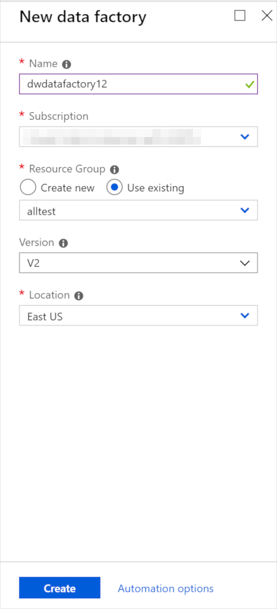

Let's start by creating an Azure storage account and an Azure Data Factory instance.

## Create an Azure storage account

1. Sign in to the [Azure portal](https://portal.azure.com?azure-portal=true).
1. In the left pane, select **+ Create a resource**.
1. In the **Search the Marketplace** box, enter **storage account** and press Enter.
1. Select **Storage account - blob, file, table, queue** from the search results, and then select **Create**.

   

1. In the **Create storage account** pane, use the following settings:

   - **Subscription:** Select the subscription you're using for this module.
   - **Resource group:** Choose your module resource group.
   - **Storage account name:** Enter a unique name (make sure you see a green check mark).
   - **Location:** Select the location you're using for resources in this module.
   - **Performance:** Select **Standard**.
   - **Account kind:** Select **Storage (general purpose v1)**.
   - **Replication:** Select **Locally redundant storage (LRS)**.

   

1. Select **Next: Advanced >**.
1. In the **Advanced** tab, use the following settings:

    - **Secure transfer required**: Select **Disabled**
    - **Virtual network**: Select **All networks**

   

1. Select **Review + create**.
1. In the **Review** tab, select **Create**.

## Acquire the account name and key

1. After your storage account is created, go to the storage account.
1. In the left pane, select **Access keys**.
1. Copy the **Storage account name** value and the **key1 Key** value into a text file for later use.

   

## Create the dwtemp container

1. In the left pane, select **Blobs**, then select **+ Container** to create a new container.
1. Enter **dwtemp** for the container name.
1. Leave  **Public access level** set to **Private (no anonymous access)**.
1. Select **OK**.

   

## Create an Azure Data Factory instance

1. Go to the [Azure portal](https://portal.azure.com?azure-portal=true).
1. In the left menu, select **+ Create a resource**.
1. In the **Search the Marketplace** box, enter **data factory** and press Enter.
1. Select **Data Factory** from the search results, and then select **Create**.

   

1. In the **New data factory** pane, use the following settings:

    - **Name:** Enter a globally unique name, as indicated by a green check mark.
    - **Subscription:** Select the subscription you're using for this workshop.
    - **Resource Group:** Choose **Use existing**, and then select the resource group for this workshop.
    - **Version:** Select **V2**.
    - **Location:** Select a region.

    

1. Select **Create** to create your data factory.