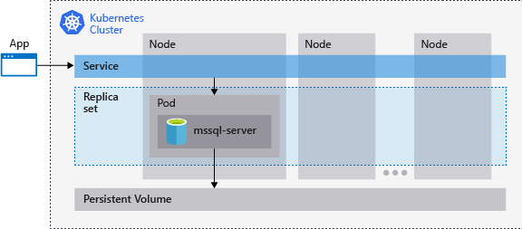

Containers can help organizations to create flexible and scalable installations of SQL Server.

Wide World Importers supports some large-scale database workloads that require a flexible and scalable hosting architecture. You want to evaluate the possibility of hosting SQL Server in virtual environments such as Virtual Machines (VMs) and Docker containers.

Here, you will learn how to choose between containers and VMs for a database.

## Comparing VMs and Containers

Virtualization is a technique that administrators use to host multiple virtual servers on a single physical server. When you use virtualization, you can easily deploy extra instances of, for example, SQL Server without buying and installing extra hardware. There are two common approaches to virtualization:

- **Virtual Machines (VMs).** When you use VMs, each instance is a complete virtual server, with its own operating system and hardware.
- **Containers.** When you use containers, each instance shares an operating system and hardware resources with the host computer.

Both VMs and containers provide an isolated environment in which applications, such as SQL Server, can run as if they were running on a separate physical computer.

VMs are larger and take longer to create but, because they have their own operating system, they can use a different configuration and hardware to the host computer. You can also mix VMs with different operating systems on the same host. For example, on a Linux host, you could install a VM running Linux and Apache to host a website, plus another VM running Windows and SQL Server to host a database.

Containers are smaller, so they can load much more quickly than VMs. However, if your host runs Linux Ubuntu, for example, all the containers on that computer must run the same version of Ubuntu. On a Linux host, you could install a container running Linux and Apache but your database container must also run Linux. Since SQL Server 2017 is supported on Linux, this architecture is now possible.

On the host machine, you must install software such as Hyper-V or Virtual Box to host VMs. For containers, use the Docker system.

## Reasons to use Virtual Machines

There are still situations for which containers aren't the best solution. As containers run on a single operating system, and share system resources, security can be a concern. If an attacker gains **superuser** privileges, some vectors could lead to gaining access to the applications. In containers, applications have to run on the same OS as the host OS. You cannot run Linux-based applications in containers on Windows. With VMs you can host a Linux machine on Windows, or a Windows machine on macOS, giving you greater flexibility. VMs allow you to host multiple applications, with tight integration, in a single VM. Containers traditionally only host single applications.

VMs are less efficient than containers. On a given set of hardware, you can run at least double the number of applications in containers than you can with VMs. A VM uses more resources because it needs a complete copy of the operating system and also virtualized versions of all the hardware to support the guest operating system.

## Reasons to use Containers

Containers are more lightweight in comparison and allow you to package apps into a smaller footprint. As a single operating system is hosting the containers, there is less administration because you only need to patch and update a single OS, rather than each guest OS on each VM. With the containers being smaller and more straightforward, they can be started in seconds rather than the minutes it takes to start a VM.

## Orchestration

Docker Swarm or Kubernetes can orchestrate Docker containers. Both technologies monitor and make it possible to scale apps using containers and provide a level of disaster recovery. Microsoft provides tools and examples of how to use Kubernetes, so it is a good choice for containerizing SQL Server on Linux. There is a SQL Server on Linux Docker image available for use with Kubernetes.

## Containerized SQL Server on Linux

One problem with databases running in containers is persistent storage. You must provide a storage location outside the container where the database can keep database files so that changes are available to all containers in a cluster. If you use Kubernetes, you can use a persistent volume for this location.

First, create a persistent volume and then add a persistent volume claim (PVC). Create a deployment manifest for SQL Server on Linux that uses the Microsoft created `mssql-server-linux` Docker image. The manifest also contains definitions for the PVC and a load balancer for the service, to guarantee a consistent IP address. Create the deployment and check that SQL Server is running inside a pod. With this setup complete, Kubernetes will bootstrap a new instance if the node fails. A simple test is to delete that pod and check that a new one starts automatically.