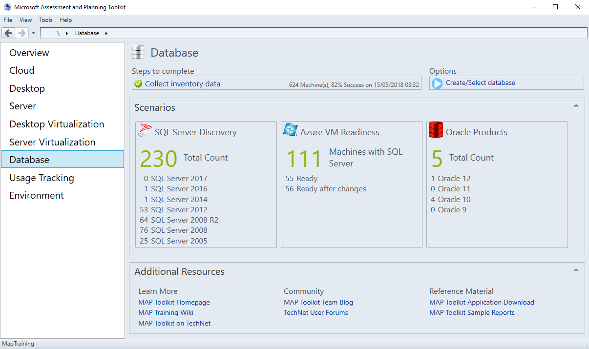
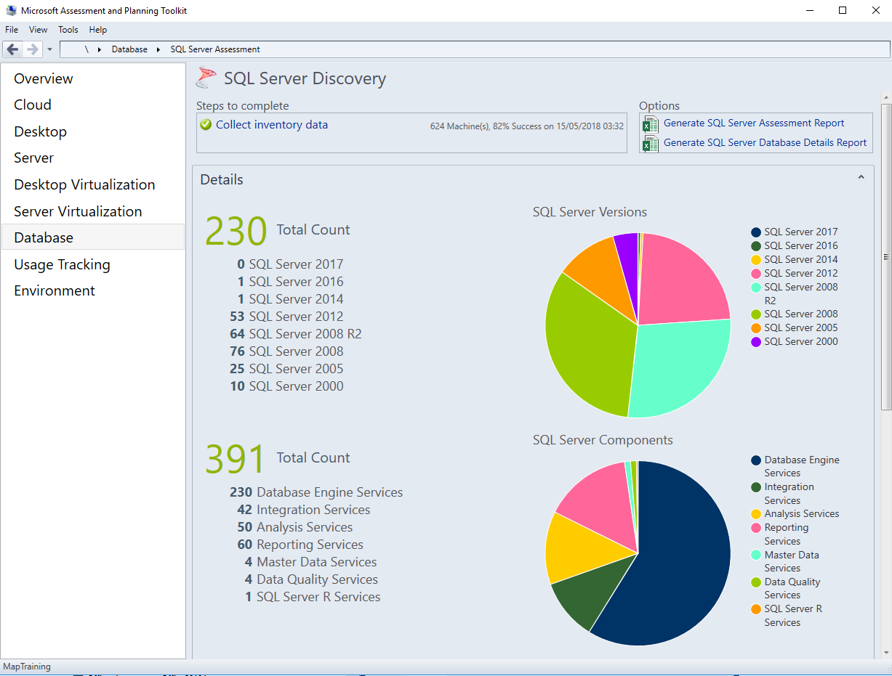

**Microsoft Assessment and Planning (MAP)** can collect a range of information from your IT estate. For database administrators, it can collect essential information about the servers running SQL, but also details about the databases running on them.

Suppose you're a newly hired database administrator, taking an inventory of all the SQL Server instances within your corporate environment, and you want to identify databases requiring an upgrade. You're concerned about the number of critical business applications still using SQL Server 2005 databases, as they're no longer supported by Microsoft. Furthermore, there are SQL Server 2008 instances that you want to upgrade before support expires.

Completing a corporate-wide inventory of SQL Server instances and the supporting hardware can be a tedious, repetitive, and time-consuming task. It's helpful to automate a task such as this, to reduce the time and the potential for mistake through human error.

Automated audits are especially important in larger operations, as more instances means more time required for the audit process. A regular audit helps highlight potential security and stability issues in unsupported SQL Server versions on old hardware, and enables a clear plan for doing system upgrades.

In this unit, you'll see how MAP can collect the information you need to inventory your companies SQL Servers, and find the servers and databases that need upgrading.

## How to collect inventory data

You use the MAP toolkit to scan your network for servers, or supply credentials for a specific computer. Depending on the purpose of your audit, select the information you want the toolkit to gather in the inventory. It's possible to search for Windows, Linux, VMware computers, Exchange, Lync/Skype for Business, SQL Servers, or Active Directory (AD) users.

To do an assessment of your SQL Servers for potential upgrade, you should focus on the **SQL Server** option.

## Assess the inventory data

After running the inventory operation, the toolkit returns a high-level view of your landscape.

Under the **Database** view, the **SQL Server Discovery** report provides a count of SQL Servers by version, the number of services by type, the total number of licenses by edition, and a count of developer and free editions.

**SQL Server Versions** shows the breakdown of the total count by version number, such as 10 SQL Server 2000 servers, 76 SQL Server 2008 servers, and 1 SQL Server 2016 server. The **SQL Server Component** count displays the number of services installed across the landscape. The categories of service types are:

- Database Engine
- Integration Services
- Analysis Services
- Reporting Services
- Master Data Services
- Data Quality Services
- SQL Server R Services

**Licensed Editions** is split into paid-for licenses, and free licenses. Paid-for licenses are slightly less easy to compare because of the differences across versions. For example, the Business Intelligence edition was introduced in SQL Server 2012, but removed in a later version, but the Standard and Enterprise editions have existed from SQL Server 2000 through SQL Server 2017.

The free editions are useful to include in your inventory. These include Evaluation, Express, Desktop, and Developer. Periodically it's good practice to check that no production databases are running on free versions of SQL Server.

The SQL Server Discovery tab displays the numeric counts of versions, installed service components, licenses, and plots these values in pie charts, delivering a visual and immediate breakdown of your landscape. To dig deeper into the inventory data, you can export the assessment data to Excel.

## Export Assessment Report to Excel

The SQL Server Discovery tab provides two export options: **Generate SQL Server Assessment Report**, and **Generate SQL Server Database Details Report**. The SQL Server Assessment Report provides an in-depth breakdown of your instances, which would be incredibly time-consuming to generate manually in an organization running anything more than a handful of SQL Servers. The data is written into a pre-formatted matrix including filters, so you can assess your environment without any delay.

The **Summary** tab includes a list of installed services and a count of each. The **Database Instances** tab delivers an extensive table of instance data. The tab includes the computer name, SQL Server instance name, version, edition, Service Pack, clustering information, service state (Running or Stopped), operating system, logical disk space, and the machine type (Physical or Virtual).

The **SQL Server Database Details** report digs deeper into the configuration of each database on your landscape. The **Overview** tab aggregates the number of database engine instances found by SQL Server version, and includes the count of databases on those servers. The **SQL Server Summary** tab displays a count of instances on each server, and the number of user databases. By including instance names, you can see where a hardware resource is being shared by SQL Server instances, or by other servers such as SharePoint and Office.

You can view a complete list of databases in the **SQL Server Database Summary** tab. Information is shown for the server, instance, and database name. This tab also shows the size of the database, data, log files, and the space and percentage used within the log file. You can also filter on the compatibility level, or last backup time, and see counts of tables, views, stored procedures, and functions. If you're doing any consolidation work as part of your upgrades, then information on file growth and usage can help you focus your attention on the servers and instances that may be good candidates for consolidation.

The **SQL Server Database Engine Instances Summary** tab includes the version number of each instance, the collation sequence, number of users, and license type. For active settings, you can use the **SQL Server Database Engine Instance Properties** tab, which highlights which features are enabled, such as **backup compression**, **CLR**, **contained database authentication**, and **xp_cmdshell**. The extensive list of options are presented alphabetically to help you quickly locate the information you need.  

Finally, the **Database User Details** tab lists all the users against roles, logins, and their default database and schema. This tab is a quick and easy way to do a fast security audit of your databases, and show which users have access to any database you may want to upgrade or migrate to a new server. You'll want to ensure the user is migrated along with the database.

## Summary

The MAP Toolkit provides database administrators with vital information that is useful to keep close at hand, especially in a production environment. Questions from the business about the landscape can be answered with speed and accuracy.

Having a count of instances and databases by version helps to gauge the time required to complete upgrades. In practice, organizations will block out time, out of hours, over weekends, or during the lowest period of usage, to do the system upgrades. By having a precise list of databases to upgrade, you can make a best guess at the time needed to finish an upgrade operation and schedule the change. This information helps you inform the business, or users, of proposed upgrades enabling work to be managed around this.
