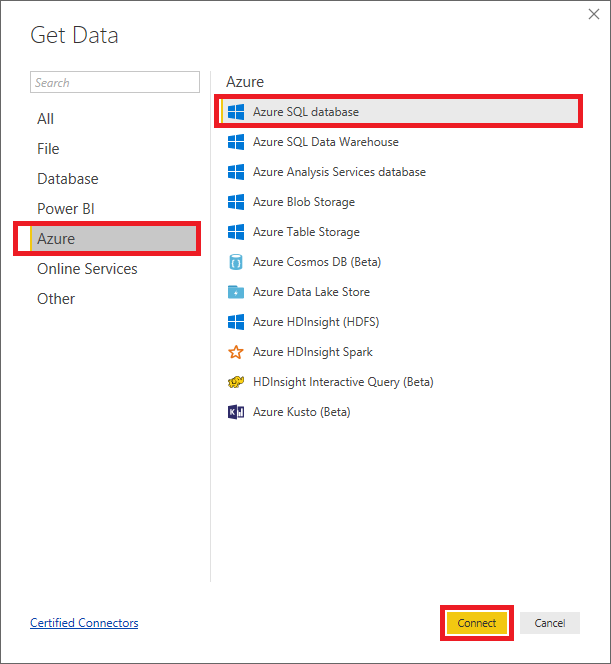
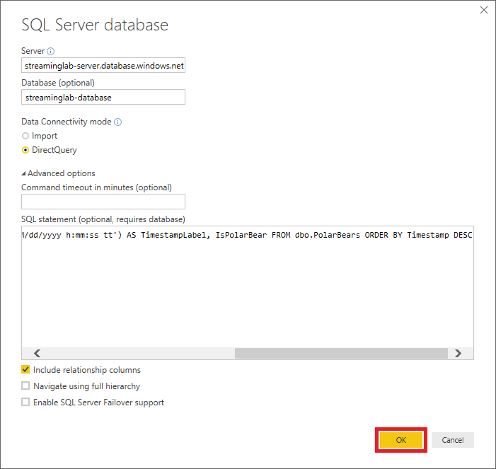
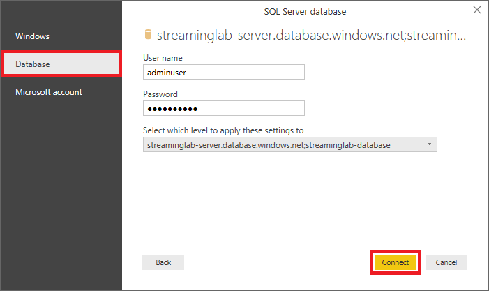
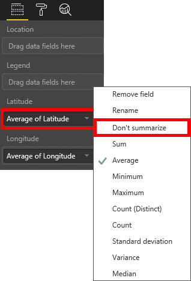
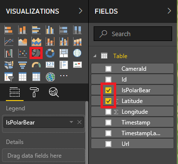
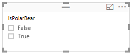
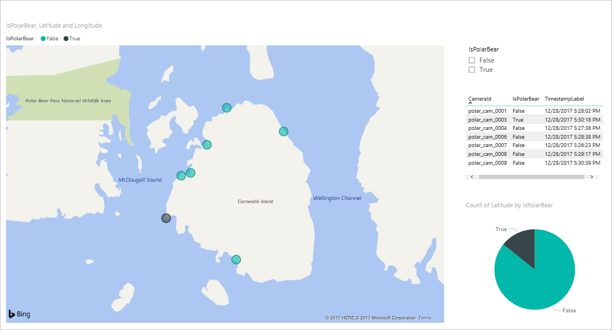

[Microsoft Power BI](https://powerbi.microsoft.com) was created to address the data explosion in commercial and academic organizations: the need to analyze that data, and the need for rich, interactive visuals to represent the data, and reveal key insights. It contains a suite of tools that assist in data analysis, from data discovery and collection to data transformation, aggregation, sharing, and collaboration. It a powerful tool that allows you to create rich visualizations and package them in interactive dashboards.

The first step in using Microsoft Power BI to explore and visualize the data in the Azure SQL database is to connect the database to Power BI as a data source.

## Connect Power BI to Azure SQL

1. If Power BI Desktop isn't already installed on your computer, go to <https://powerbi.microsoft.com/desktop/> and install it now.

1. Start Power BI Desktop. If you're asked to sign in, use the same account you're using in the Azure portal.

1. Click **Get Data** in the ribbon at the top of the window.

1. Select **Azure SQL database** from the list of data sources.

1. Select the **Connect** button.

    

1. Enter the server's host name (the server name you specified previously plus ".database.windows.net" since it's an Azure SQL database server) and the database name.

1. Select **DirectQuery**, and click **Advanced options**.

1. Then type the query below into the "SQL statement" box to select the 20 most recently added rows in the "PolarBears" table. This is the query that the report will use to pull information from the database. When you're done, click **OK**. Then click the **Load** button in the ensuing dialog.

    ```sql
    SELECT TOP 20 Id, CameraId, Latitude, Longitude, Url, Timestamp, 
        FORMAT(Timestamp,'MM/dd/yyyy h:mm:ss tt') AS TimestampLabel, 
        IsPolarBear 
    FROM dbo.PolarBears 
    ORDER BY Timestamp DESC
    ```

    

1. If prompted, enter the user name and password you specified when you created the database server, and select the database from the drop-down list labeled "Select which level." Then click **Connect**.

    

After a short delay, Power BI will connect to the database and import a dataset using the query you provided.

## Create a report from the dataset

Visualizations (or simply "visuals") are the primary elements that make up Power BI reports. In this section, you'll use the Power BI report designer to create visuals from the database you connected to in the previous exercise, adjust filters and aggregates to refine the way the data is displayed, and format the visuals to produce compelling output.

1. Click the **Map** icon in the "Visualizations" panel to add a map visual to the report.

    

1. Check the **Latitude** and **Longitude** boxes in the "Fields" panel to include these fields in the visual.

    

1. In the "Visualizations" panel, click the down arrow next to **Average of Latitude** and select **Don't summarize** from the menu. Then do the same for **Average of Longitude**.

    

1. Return to the "Fields" panel and check the **IsPolarBear** box to add that field to the map. Then resize the map so that it looks something like this:

    

    The number and location of the "bubbles" in your map will probably be different than what's shown here.

1. Click in the empty area outside the map to deselect it. Then check the **CameraId**, **IsPolarBear**, and **TimestampLabel** boxes in the "Fields" panel to add a table visual containing those columns to the report.

    

1. Deselect the table visual. Then check **IsPolarBear** and **Latitude** in the "Fields" panel to add another table visual, and click the **Pie Chart** icon in the "Visualizations" panel to convert the table into a pie chart.

    

1. Click the down arrow next to **Average of Latitude** and select **Count** from the menu to configure the pie chart to show a count of sightings and the proportion of sightings in which polar bears were detected.

    

1. Deselect the pie-chart visual and click the **Slicer** icon to add a slicer to the report. Slicers provide a convenient means for filtering information in a Power BI report by narrowing the data shown in other visuals.

    

1. Select the **IsPolarBear** field in the "Fields" panel so the slicer shows checkboxes labeled "True" and "False."

    

1. Now resize and reposition the visuals to achieve a layout similar to this:

    

## Use Power BI formatting

With the report structure in place, the next task is to use some of Power BI's rich formatting options to embellish the visuals.

1. Start by selecting the map visual in the report designer. Then click the **Format** icon in the "Visualizations" panel.

    

1. Use the formatting controls in the "Visualizations" panel to make the following changes to the map visual:

    - Under "Legend," set "Legend Name" to "Polar bear sighted?"
    - Under "Data colors," set the color for False to `00FF00` (pure green) and the color for True to `FF0000` (pure red)
    - Under "Bubbles," set  the bubble size to 30%
    - Under "Map styles," set the theme to "Aerial"
    - Turn "Title" from on to off

    Confirm that the resulting map looks something like this:

    

1. Select the pie-chart visual and use the formatting controls in the "Visualizations" panel to make the following changes:

    - Under "Data colors," set False to `00FF00` and True to `FF0000`
    - Under "Detail  labels," change the label style to "Data value, percent of total"
    - Under "Title," change the title text to "Proportion of polar bear sightings"

    Confirm that the resulting pie-chart visual resembles this:

    

1. Select the table visual and use the formatting controls in the "Visualizations" panel to make the following changes:

    - Under "Style," change the table style to "Alternating rows"
    - Turn "Title" on, and change the title text to "Camera activity"

    Confirm that the resulting table looks like this:

    

1. Select the slicer visual and use the formatting controls in the "Visualizations" panel to make the following changes:

    - Under "Selection Controls," set "Single Select" to off
    - Turn off "Visual Header"
    - Turn "Title" on and set the title text to "Show sightings that are:"

1. Double-click **Page 1** in the bottom-left corner of the designer and change the report title to "Polar Bear Activity."

1. Use the **File > Save** command to save the report.

The formatted report should resemble the one below. Feel free to embellish it further. You could, for example, add a title in a large font at the top of the report. Once you're satisfied with the layout and content, it's time to put it to work using a live data source.


## Run the whole simulation

Now that the report is prepared in Power BI, your final task is to run the end-to-end solution that you built in this series of hands-on labs and check for polar bears!

1. Open the database in the [Azure portal](https://portal.azure.com?azure-portal=true) and use the query editor to execute the following query and delete all rows from the `PolarBears` table:

    ```sql
    DELETE FROM dbo.PolarBears
    ```

1. Open the Stream Analytics job in the Azure portal and start the job.

1. Wait until the Stream Analytics job is running. Then switch to the Azure Cloud Shell window and make sure you are in the project directory you created.

1. Use the following command to start the virtual cameras running:

    ```bash
    node run.js
    ```

1. Return to Power BI Desktop and click **Refresh** in the ribbon at the top of the window. Click it again every 15 seconds or so. The report will refresh automatically every 15 minutes or so, but you can refresh it manually as often as you would like to update the visuals.

1. Confirm that red and green bubbles appear at various locations around the island. Red bubbles indicate the presence of polar bears, while green bubbles represent locations where photos were taken but no polar bears were detected. Locations that have a mixture of sightings will show red *and* green, as pictured below.

    

1. Suppose you *only* wanted to show locations where polar bears were detected. Check the **True** box in the slicer visual. What happens in the map?

1. Continue running for a few minutes and refreshing the report once or twice a minute. Confirm that there are polar bears active on the island!

1. When you're satisfied that the solution is working as intended, stop the cameras and stop the Stream Analytics job.

You now have a report that shows, in near real-time, polar-bear activity on the island. If you have a [Power BI Pro or Power BI Premium](https://powerbi.microsoft.com/blog/power-bi-pro-power-bi-premium-flexibility-to-choose-the-licensing-best-for-you-and-your-organization/) account, you can share the report with other Power BI users so they, too, can monitor polar-bear activity. For more information about sharing your work, see [Share Power BI Dashboards and Reports](https://docs.microsoft.com/power-bi/service-how-to-collaborate-distribute-dashboards-reports "Share Power BI Dashboards and Reports"). Reports can also be viewed in the [Power BI mobile apps](https://docs.microsoft.com/power-bi/mobile-apps-for-mobile-devices) so you can keep track of polar bears on your Windows, Android, or iOS device — even on an Apple watch!